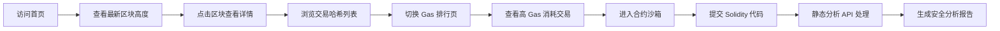

## 1. 产品概述
以太坊区块链浏览器与 Solidity 智能合约静态分析平台，提供区块数据可视化与合约安全审计功能。
- 面向区块链开发者、研究者及爱好者，提供链上数据查询与合约安全检测服务
- 目标是打造集数据展示、安全分析于一体的一站式区块链开发工具平台

## 2. 核心功能

### 2.1 用户角色
| 角色 | 注册方式 | 核心权限 |
|------|----------|----------|
| 普通用户 | 无需注册 | 浏览区块数据、使用合约分析沙箱 |

### 2.2 功能模块
1. **仪表盘首页**：最新区块高度概览、实时数据统计卡片
2. **区块浏览**：区块高度列表、区块详情、交易哈希展示
3. **Gas 排行**：Gas 消耗排行榜、交易费用分析
4. **合约沙箱**：Solidity 代码编辑器、静态分析 API、安全报告输出

### 2.3 页面详情
| 页面名称 | 模块名称 | 功能描述 |
|---------|----------|----------|
| 首页仪表盘 | 数据概览卡片 | 显示最新区块高度、总交易数、平均 Gas 价格、24h 交易量 |
| 首页仪表盘 | 最新区块列表 | 展示最近 10 个区块的高度、时间、交易数量 |
| 区块详情页 | 区块信息 | 显示区块高度、哈希、时间戳、难度、矿工地址 |
| 区块详情页 | 交易列表 | 展示该区块内所有交易的哈希、发送方、接收方、金额 |
| Gas 排行页 | Gas 消耗排行 | 按 Gas 消耗量降序排列交易，显示交易哈希、Gas 使用量、Gas 价格 |
| 合约沙箱页 | 代码编辑器 | 支持 Solidity 语法高亮、行号显示、代码格式化 |
| 合约沙箱页 | 分析结果 | 显示安全问题、警告、优化建议，支持按严重程度筛选 |

## 3. 核心流程
用户访问首页查看最新区块高度 → 点击区块查看交易列表及哈希 → 切换到 Gas 排行页面查看高消耗交易 → 进入合约沙箱提交 Solidity 代码 → 系统执行静态分析并生成安全报告。

## 4. 用户界面设计

### 4.1 设计风格
- 主色调：深邃蓝 (#0f172a) 搭配科技青 (#06b6d4)，体现区块链技术感
- 辅助色：警告黄 (#f59e0b)、危险红 (#ef4444)、成功绿 (#10b981) 用于安全报告分级
- 按钮风格：圆角 6px，悬停时有轻微发光效果，点击有按压反馈
- 字体：使用 JetBrains Mono 作为代码字体，Space Grotesk 作为标题字体，Inter 作为正文字体
- 布局：左侧固定导航栏 + 右侧内容区，卡片式布局，毛玻璃效果背景
- 图标：使用 lucide-react 线性图标，统一 16px 尺寸

### 4.2 页面设计概述
| 页面名称 | 模块名称 | UI 元素 |
|---------|----------|---------|
| 首页仪表盘 | 数据概览卡片 | 4 个统计卡片横向排列，渐变背景，数字动画效果，图标在右上角 |
| 首页仪表盘 | 最新区块列表 | 表格展示，斑马纹背景，悬停高亮，点击跳转 |
| 区块详情页 | 区块信息 | 键值对网格布局，标签右对齐，值左对齐，重要数据高亮 |
| 区块详情页 | 交易列表 | 可滚动表格，哈希值截断显示，悬停显示完整哈希，可复制 |
| Gas 排行页 | Gas 消耗排行 | 排名徽章，进度条可视化 Gas 使用量，三列布局（排名/交易哈希/Gas 数据） |
| 合约沙箱页 | 代码编辑器 | 深色主题，行号，语法高亮，左侧占 60% 宽度 |
| 合约沙箱页 | 分析结果 | 右侧占 40% 宽度，标签页切换（问题/警告/优化），可折叠条目 |

### 4.3 响应式
- 桌面端（≥1280px）：左侧导航固定宽度 240px，内容区自适应
- 平板端（768px-1279px）：导航栏折叠为图标模式，宽度 64px
- 移动端（<768px）：导航栏改为底部 Tab 栏，卡片改为单列堆叠，表格支持横向滚动

### 4.4 动效设计
- 页面加载：元素依次淡入，延迟 50ms 递增
- 数据更新：数字滚动动画，新数据从上方滑入
- 悬停效果：卡片轻微上浮（translateY(-2px)），阴影加深
- 代码编辑器：光标闪烁，输入时字符淡入
- 分析进度：进度条渐变流动，状态指示器脉冲动画
