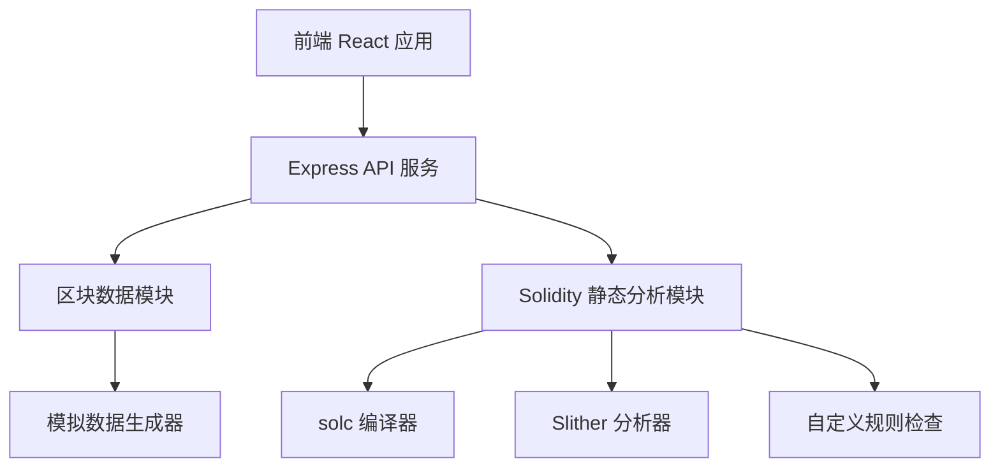
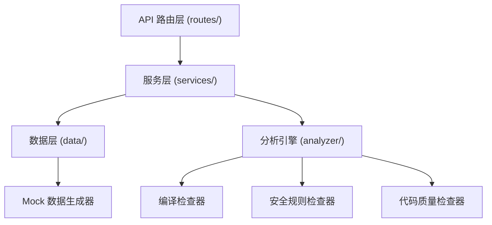
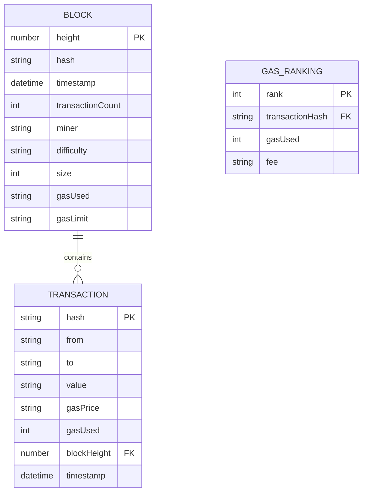

## 1. 架构设计



## 2. 技术描述
- 前端：React@18 + TypeScript + Vite + TailwindCSS@3 + Zustand + lucide-react
- 代码编辑器：@monaco-editor/react
- 后端：Express@4 + TypeScript + ESM
- 静态分析：solc (Solidity 编译器) + 自定义规则引擎
- 数据：Mock 数据模拟以太坊区块和交易数据
- 初始化工具：vite-init

## 3. 路由定义
| 路由 | 用途 |
|------|------|
| / | 首页仪表盘，展示区块高度和最新区块 |
| /block/:height | 区块详情页，展示交易哈希列表 |
| /gas-ranking | Gas 消耗排行榜 |
| /sandbox | 合约静态分析沙箱 |
| /api/blocks | 获取区块列表 API |
| /api/blocks/:height | 获取单个区块详情 API |
| /api/transactions | 获取交易列表 API |
| /api/gas-ranking | 获取 Gas 排行数据 API |
| /api/analyze | Solidity 合约静态分析 API |

## 4. API 定义

### 4.1 类型定义
```typescript
interface Block {
  height: number;
  hash: string;
  timestamp: number;
  transactions: number;
  miner: string;
  difficulty: string;
  size: number;
  gasUsed: string;
  gasLimit: string;
}

interface Transaction {
  hash: string;
  from: string;
  to: string;
  value: string;
  gasPrice: string;
  gasUsed: number;
  blockHeight: number;
  timestamp: number;
}

interface GasRankingItem {
  rank: number;
  hash: string;
  gasUsed: number;
  gasPrice: string;
  fee: string;
  from: string;
  to: string;
  timestamp: number;
}

interface AnalyzeRequest {
  code: string;
  version?: string;
}

interface AnalyzeIssue {
  severity: 'error' | 'warning' | 'info' | 'optimization';
  line: number;
  column: number;
  message: string;
  ruleId: string;
  suggestion?: string;
}

interface AnalyzeResponse {
  success: boolean;
  issues: AnalyzeIssue[];
  summary: {
    errors: number;
    warnings: number;
    infos: number;
    optimizations: number;
  };
  compileTime: number;
  analysisTime: number;
}
```

### 4.2 API 接口说明
- `GET /api/blocks?limit=10`：获取最新区块列表
- `GET /api/blocks/:height`：获取指定高度的区块详情及交易列表
- `GET /api/gas-ranking?limit=20`：获取 Gas 消耗排行榜
- `POST /api/analyze`：提交 Solidity 代码进行静态分析
  - Request Body: `{ code: string, version?: string }`
  - Response: `AnalyzeResponse`

## 5. 服务器架构图



## 6. 数据模型

### 6.1 数据模型定义


### 6.2 Mock 数据结构
由于使用模拟数据，通过以下函数生成：
- `generateMockBlocks(count: number): Block[]`：生成指定数量的模拟区块
- `generateMockTransactions(blockHeight: number, count: number): Transaction[]`：生成区块内的交易
- `generateGasRanking(count: number): GasRankingItem[]`：生成 Gas 排行数据
- 所有哈希值使用 `0x` 前缀 + 64 位十六进制随机字符串
- 地址使用 `0x` 前缀 + 40 位十六进制随机字符串
