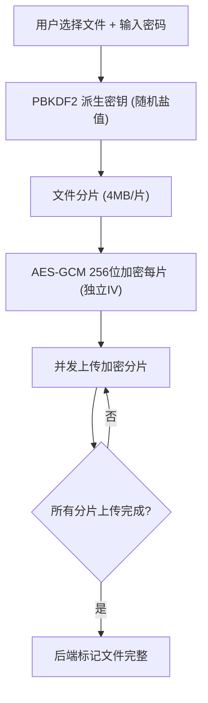
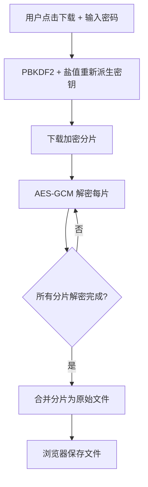

## 1. 产品概述

高安全性分布式文件存储系统（SecureVault）—— 在浏览器端完成文件分片与 AES-GCM 256位加密，后端仅接触密文，确保零信任架构下的端到端数据安全。面向对数据隐私有极高要求的个人用户与企业团队。

- 核心价值：用户密码永不上传，服务端无法解密任何文件内容，即使存储被攻破也无法还原明文
- 目标用户：注重隐私的个人用户、需要合规存储的企业团队、开发者

## 2. 核心功能

### 2.1 用户角色
| 角色 | 注册方式 | 核心权限 |
|------|----------|----------|
| 普通用户 | 密码注册 | 上传/下载/删除自己加密的文件 |
| 管理员 | 系统指定 | 用户管理、存储监控、系统配置 |

### 2.2 功能模块
1. **文件上传页**：拖拽/选择文件 → 输入加密密码 → 浏览器端分片加密 → 分片上传 → 进度展示
2. **文件列表页**：已上传加密文件列表、文件元数据展示、搜索与筛选
3. **文件下载页**：输入解密密码 → 下载加密分片 → 浏览器端解密合并 → 保存原始文件
4. **存储监控页**（管理员）：磁盘使用情况、分片分布、上传/下载统计

### 2.3 页面详情
| 页面名称 | 模块名称 | 功能描述 |
|----------|----------|----------|
| 文件上传页 | 密码输入区 | 输入加密密码，显示密码强度指示器 |
| 文件上传页 | 文件选择区 | 拖拽上传、文件类型/大小限制提示 |
| 文件上传页 | 加密进度区 | 分片进度、加密进度、上传进度三阶段展示 |
| 文件列表页 | 文件卡片列表 | 文件名、大小、上传时间、分片数、操作按钮 |
| 文件列表页 | 搜索筛选栏 | 按文件名、日期、类型筛选 |
| 文件下载页 | 解密密码输入 | 输入原始加密密码进行解密 |
| 文件下载页 | 下载进度区 | 分片下载进度、解密进度、合并进度 |
| 存储监控页 | 存储概览 | 总存储量、文件数、分片总数 |
| 存储监控页 | 分片分布图 | 各存储节点的分片分布可视化 |

## 3. 核心流程

### 3.1 文件加密上传流程
1. 用户选择文件并输入加密密码
2. 前端使用 PBKDF2 从密码派生 256 位 AES 密钥（随机盐值）
3. 文件被切分为固定大小的分片（默认 4MB）
4. 每个分片使用 AES-GCM 256 位加密（独立 IV）
5. 加密后的分片通过 HTTP POST 逐片/并发上传
6. 后端接收密文分片，存储到磁盘/MinIO，记录元数据
7. 所有分片上传完成后，标记文件状态为完整

### 3.2 文件下载解密流程
1. 用户在文件列表点击下载
2. 输入加密密码
3. 前端从后端依次下载加密分片
4. 使用 PBKDF2 + 存储的盐值从密码重新派生密钥
5. 逐片使用 AES-GCM 解密
6. 合并所有解密分片为原始文件
7. 触发浏览器下载保存

## 4. 用户界面设计

### 4.1 设计风格
- 主色调：深青色 (#0F766E) / 深海蓝 (#0C4A6E)，传达安全与信任感
- 辅助色：琥珀色 (#D97706) 用于警告和强调操作
- 按钮风格：圆角矩形 (rounded-lg)，加密相关按钮带有盾牌图标
- 字体：JetBrains Mono 用于代码/加密相关信息，Noto Sans SC 用于中文正文
- 布局风格：左侧导航栏 + 右侧内容区，卡片式布局
- 图标风格：线性图标 (lucide-react)，以安全/文件相关图标为主

### 4.2 页面设计概览
| 页面名称 | 模块名称 | UI 元素 |
|----------|----------|---------|
| 文件上传页 | 密码输入区 | 输入框 + 密码可见切换 + 强度条，深色背景，盾牌图标 |
| 文件上传页 | 文件选择区 | 虚线拖拽区域，上传图标，文件信息预览卡 |
| 文件上传页 | 加密进度区 | 三段式进度条（分片→加密→上传），动画过渡 |
| 文件列表页 | 文件卡片 | 深色卡片，文件图标，元数据标签，操作按钮组 |
| 文件列表页 | 搜索筛选 | 搜索输入框 + 下拉筛选器 |
| 文件下载页 | 解密输入 | 密码输入 + 解密按钮，钥匙图标 |
| 文件下载页 | 下载进度 | 环形进度图 + 分片状态列表 |
| 存储监控页 | 存储概览 | 统计数字卡片 + 环形占比图 |
| 存储监控页 | 分片分布 | 柱状图/热力图 |

### 4.3 响应式设计
- 桌面优先设计，最小支持 1024px 宽度
- 平板端：导航栏折叠为汉堡菜单
- 移动端：单列布局，卡片全宽

### 4.4 安全性设计细节
- 密码输入框自动禁用自动填充
- 加密过程中密码字段在内存中清零
- 上传/下载全程使用 HTTPS
- 文件列表中不显示密码相关信息
- 加密分片文件名使用 UUID，不暴露原始文件名
