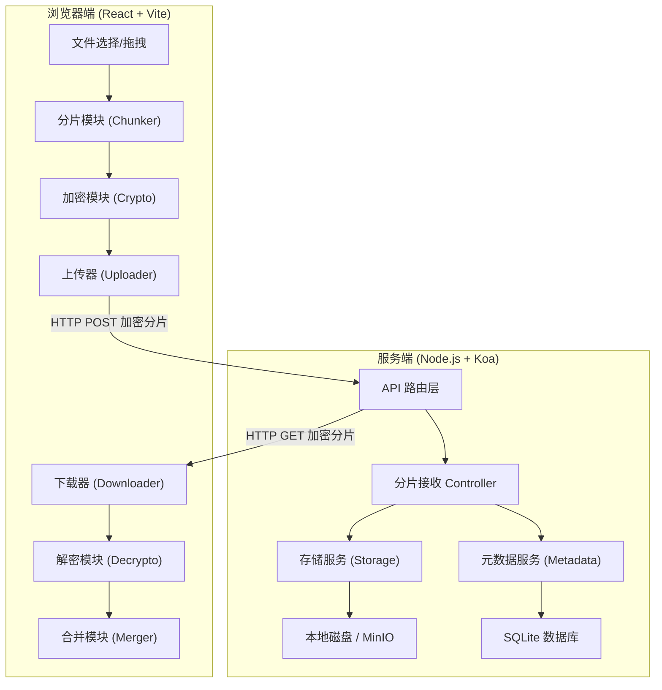
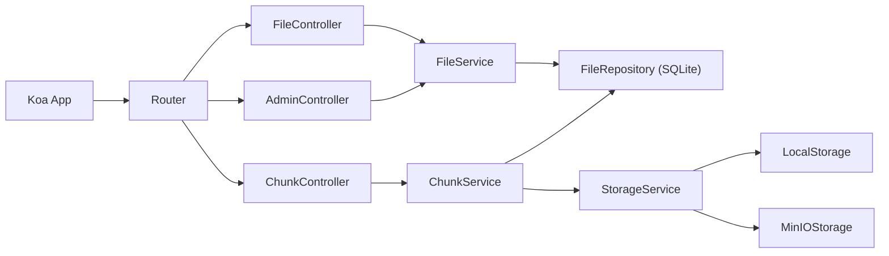
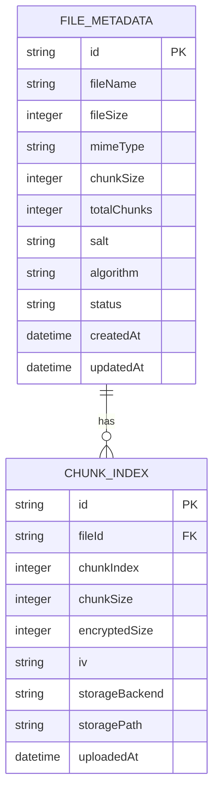

## 1. 架构设计



## 2. 技术说明

- **前端**: React@18 + TypeScript + TailwindCSS@3 + Vite
- **初始化工具**: vite-init (react-express-ts 模板，后替换 Express 为 Koa)
- **后端**: Node.js + Koa@2 + @koa/router + @koa/cors + koa-bodyparser
- **数据库**: SQLite (better-sqlite3)，轻量级本地存储
- **对象存储**: 本地磁盘优先，可选 MinIO (通过 minio Client SDK)
- **状态管理**: Zustand
- **加密**: Web Crypto API (浏览器原生，PBKDF2 + AES-GCM)

## 3. 路由定义

| 路由 | 用途 |
|------|------|
| `/` | 首页/文件上传页 |
| `/files` | 加密文件列表页 |
| `/files/:id` | 文件详情/下载页 |
| `/admin` | 存储监控页（管理员） |

## 4. API 定义

### 4.1 TypeScript 类型定义

```typescript
interface FileMetadata {
  id: string;
  fileName: string;
  fileSize: number;
  mimeType: string;
  chunkSize: number;
  totalChunks: number;
  salt: string;
  algorithm: string;
  status: 'uploading' | 'complete' | 'error';
  createdAt: string;
  updatedAt: string;
}

interface ChunkIndex {
  id: string;
  fileId: string;
  chunkIndex: number;
  chunkSize: number;
  encryptedSize: number;
  iv: string;
  storageBackend: 'local' | 'minio';
  storagePath: string;
  uploadedAt: string;
}

interface UploadChunkRequest {
  fileId: string;
  chunkIndex: number;
  iv: string;
  data: Blob;
}

interface CreateFileRequest {
  fileName: string;
  fileSize: number;
  mimeType: string;
  chunkSize: number;
  totalChunks: number;
  salt: string;
  algorithm: string;
}

interface CreateFileResponse {
  id: string;
  createdAt: string;
}
```

### 4.2 REST API

| 方法 | 路径 | 请求体 | 响应 | 描述 |
|------|------|--------|------|------|
| POST | `/api/files` | CreateFileRequest (JSON) | CreateFileResponse | 创建文件元数据 |
| POST | `/api/files/:fileId/chunks/:index` | FormData (iv + data) | `{ success: boolean }` | 上传加密分片 |
| PUT | `/api/files/:fileId/complete` | - | `{ success: boolean }` | 标记文件上传完成 |
| GET | `/api/files` | - | `FileMetadata[]` | 获取文件列表 |
| GET | `/api/files/:fileId` | - | `FileMetadata & { chunks: ChunkIndex[] }` | 获取文件详情 |
| GET | `/api/files/:fileId/chunks/:index` | - | Binary stream | 下载加密分片 |
| DELETE | `/api/files/:fileId` | - | `{ success: boolean }` | 删除文件及分片 |
| GET | `/api/admin/stats` | - | StatsResponse | 存储统计 |

## 5. 服务端架构图



## 6. 数据模型

### 6.1 数据模型定义



### 6.2 数据定义语言

```sql
CREATE TABLE IF NOT EXISTS file_metadata (
  id TEXT PRIMARY KEY,
  fileName TEXT NOT NULL,
  fileSize INTEGER NOT NULL,
  mimeType TEXT NOT NULL,
  chunkSize INTEGER NOT NULL,
  totalChunks INTEGER NOT NULL,
  salt TEXT NOT NULL,
  algorithm TEXT NOT NULL DEFAULT 'AES-GCM-256',
  status TEXT NOT NULL DEFAULT 'uploading',
  createdAt TEXT NOT NULL DEFAULT (datetime('now')),
  updatedAt TEXT NOT NULL DEFAULT (datetime('now'))
);

CREATE TABLE IF NOT EXISTS chunk_index (
  id TEXT PRIMARY KEY,
  fileId TEXT NOT NULL REFERENCES file_metadata(id) ON DELETE CASCADE,
  chunkIndex INTEGER NOT NULL,
  chunkSize INTEGER NOT NULL,
  encryptedSize INTEGER NOT NULL,
  iv TEXT NOT NULL,
  storageBackend TEXT NOT NULL DEFAULT 'local',
  storagePath TEXT NOT NULL,
  uploadedAt TEXT NOT NULL DEFAULT (datetime('now')),
  UNIQUE(fileId, chunkIndex)
);

CREATE INDEX idx_chunk_fileId ON chunk_index(fileId);
CREATE INDEX idx_file_status ON file_metadata(status);
```

## 7. 加密方案详细设计

### 7.1 密钥派生 (PBKDF2)
- 算法: PBKDF2 with SHA-256
- 盐值: 随机生成 16 字节，Base64 编码后存储于 file_metadata.salt
- 迭代次数: 600,000 次 (OWASP 2023 推荐)
- 输出: 256 位 AES 密钥

### 7.2 分片加密 (AES-GCM)
- 算法: AES-GCM 256 位
- IV: 每个分片独立生成 12 字节随机 IV，Base64 编码后存储于 chunk_index.iv
- 分片大小: 默认 4MB (可配置)
- 附加数据 (AAD): 不使用，保持简洁

### 7.3 安全注意事项
- 密码仅存在于浏览器内存，永不上传至服务器
- 盐值和 IV 可安全存储在服务端（无需保密）
- AES-GCM 提供加密 + 完整性验证，篡改任何密文分片将导致解密失败
- PBKDF2 的高迭代次数有效抵御暴力破解
