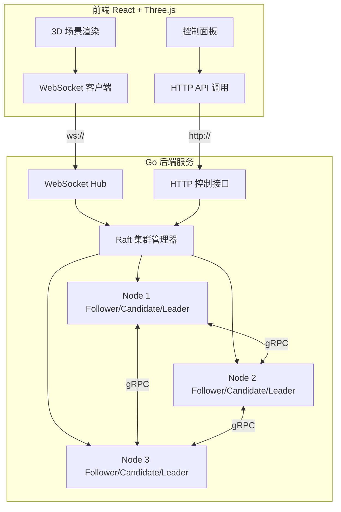
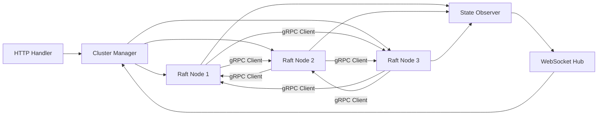
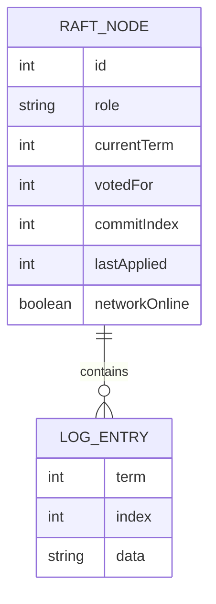

## 1. 架构设计



## 2. 技术说明

- 前端：React@18 + Three.js + @react-three/fiber + @react-three/drei + @react-three/postprocessing + Tailwind CSS + Zustand + Vite
- 后端：Go 1.21+ + gRPC + gorilla/websocket + net/http
- 通信协议：gRPC（节点间 Raft RPC）、WebSocket（状态推送）、HTTP REST（控制命令）
- 初始化工具：vite-init

## 3. 路由定义

| 路由 | 用途 |
|------|------|
| / | 主页面，3D 可视化 + 控制面板 |

## 4. API 定义

### 4.1 WebSocket 消息格式（后端 → 前端）

```typescript
interface RaftStateMessage {
  type: "state_update"
  nodes: RaftNodeState[]
}

interface RaftEventMessage {
  type: "event"
  event: RaftEvent
}

interface RaftNodeState {
  id: number
  role: "leader" | "follower" | "candidate"
  term: number
  logLength: number
  commitIndex: number
  votedFor: number | null
  networkOnline: boolean
}

interface RaftEvent {
  timestamp: number
  eventType: "election" | "heartbeat" | "log_replication" | "network_change" | "state_change"
  sourceNode: number
  targetNode?: number
  detail: string
}
```

### 4.2 HTTP REST 接口（前端 → 后端）

```typescript
// 获取集群状态
GET /api/cluster
Response: { nodes: RaftNodeState[] }

// 切换节点网络状态
POST /api/nodes/:id/network
Body: { online: boolean }
Response: { success: boolean }

// 停止节点
POST /api/nodes/:id/stop
Response: { success: boolean }

// 启动节点
POST /api/nodes/:id/start
Response: { success: boolean }

// 提交日志
POST /api/cluster/log
Body: { data: string }
Response: { success: boolean, logIndex: number }

// 触发选举
POST /api/cluster/elect
Body: { nodeId: number }
Response: { success: boolean }

// 重置集群
POST /api/cluster/reset
Response: { success: boolean }
```

### 4.3 gRPC 接口（节点间通信）

```protobuf
service RaftService {
  rpc RequestVote(RequestVoteRequest) returns (RequestVoteResponse);
  rpc AppendEntries(AppendEntriesRequest) returns (AppendEntriesResponse);
}

message RequestVoteRequest {
  int32 term = 1;
  int32 candidateId = 2;
  int32 lastLogIndex = 3;
  int32 lastLogTerm = 4;
}

message RequestVoteResponse {
  int32 term = 1;
  bool voteGranted = 2;
}

message AppendEntriesRequest {
  int32 term = 1;
  int32 leaderId = 2;
  int32 prevLogIndex = 3;
  int32 prevLogTerm = 4;
  repeated LogEntry entries = 5;
  int32 leaderCommit = 6;
}

message AppendEntriesResponse {
  int32 term = 1;
  bool success = 2;
  int32 matchIndex = 3;
}

message LogEntry {
  int32 term = 1;
  int32 index = 2;
  string data = 3;
}
```

## 5. 服务端架构图



## 6. 数据模型

### 6.1 Raft 节点内存状态



### 6.2 前端状态模型（Zustand Store）

```typescript
interface RaftStore {
  nodes: RaftNodeState[]
  events: RaftEvent[]
  selectedNodeId: number | null
  networkLinks: NetworkLink[]

  updateNodeState: (state: RaftNodeState) => void
  addEvent: (event: RaftEvent) => void
  setSelectedNode: (id: number | null) => void
  toggleNetwork: (nodeId: number) => void
  submitLog: (data: string) => void
  triggerElection: (nodeId: number) => void
  resetCluster: () => void
}

interface NetworkLink {
  from: number
  to: number
  active: boolean
  rpcType: "heartbeat" | "vote" | "append_entries"
}
```
