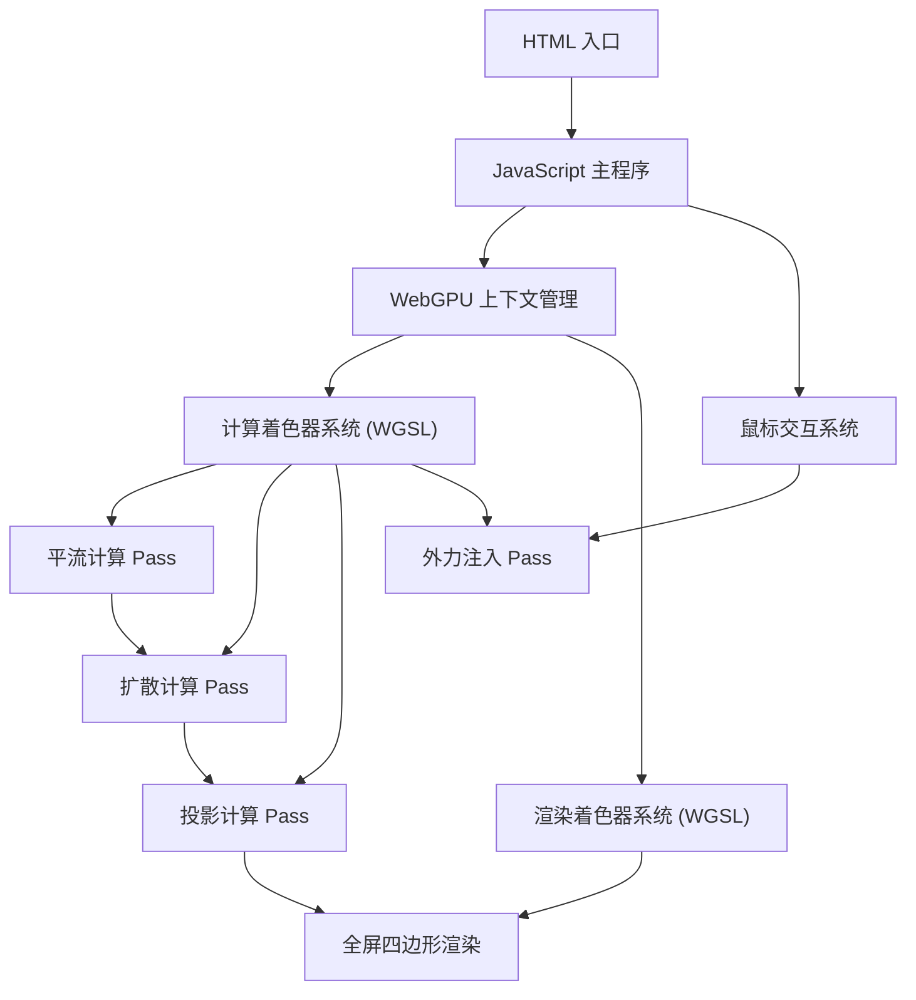

## 1. 架构设计



## 2. 技术描述

- **前端**：原生 HTML5 + Vanilla JavaScript + WebGPU API
- **着色器语言**：WGSL (WebGPU Shading Language)
- **构建工具**：无构建工具，直接运行原生代码
- **核心算法**：基于 Stable Fluids 的 Navier-Stokes 方程求解
  - 平流步骤 (Advection)：半拉格朗日方法
  - 扩散步骤 (Diffusion)：雅可比迭代
  - 投影步骤 (Projection)：求解泊松方程以确保不可压缩性

## 3. 项目结构

| 文件路径 | 作用 |
|-------|---------|
| `/index.html` | 入口 HTML 文件，包含 Canvas 和 UI |
| `/js/main.js` | 主程序入口，WebGPU 初始化 |
| `/js/fluid-simulator.js` | 流体模拟器核心类 |
| `/shaders/compute.wgsl` | 计算着色器（平流、扩散、投影） |
| `/shaders/render.wgsl` | 渲染着色器（密度场可视化） |

## 4. 数据结构

### 4.1 GPU 资源

| 资源类型 | 名称 | 格式 | 用途 |
|---------|------|------|------|
| 纹理 | velocityTexture | rg32float | 速度场存储（x, y 分量） |
| 纹理 | densityTexture | r32float | 密度场存储 |
| 纹理 | pressureTexture | r32float | 压力场存储 |
| 纹理 | divergenceTexture | r32float | 散度场存储 |
| 缓冲区 | uniforms | uniform buffer | 模拟参数（dt, dissipation 等） |
| 缓冲区 | mouseInput | storage buffer | 鼠标位置、速度、强度 |

### 4.2 模拟参数

```javascript
const SIMULATION_PARAMS = {
  resolution: 512,           // 模拟分辨率
  timeStep: 0.016,           // 时间步长
  velocityDissipation: 0.99, // 速度耗散系数
  densityDissipation: 0.995, // 密度耗散系数
  pressureIterations: 20,    // 压力求解迭代次数
  splatRadius: 0.02,         // 外力注入半径
  splatStrength: 5000,       // 外力注入强度
};
```

## 5. 计算管线定义

### 5.1 平流计算 (Advection)
```wgsl
// 半拉格朗日平流：从当前位置追溯到上一帧位置采样
fn advect(velocity: vec2f, position: vec2f, dt: f32) -> vec2f
```

### 5.2 扩散计算 (Diffusion)
```wgsl
// 雅可比迭代求解扩散方程
fn diffuse(value: f32, neighbors: vec4f, alpha: f32, beta: f32) -> f32
```

### 5.3 投影计算 (Projection)
```wgsl
// 步骤1：计算速度场散度
fn computeDivergence(velocity: texture_2d<f32>, coord: vec2u) -> f32

// 步骤2：迭代求解压力泊松方程  
fn solvePressure(pressure: texture_2d<f32>, divergence: f32, coord: vec2u) -> f32

// 步骤3：用压力场修正速度，使其无散度
fn subtractGradient(velocity: vec2f, pressure: texture_2d<f32>, coord: vec2u) -> vec2f
```

## 6. 渲染管线定义

### 6.1 顶点着色器
- 输出全屏三角形/四边形的顶点位置

### 6.2 片段着色器
```wgsl
// 将密度值映射为颜色
fn densityToColor(density: f32) -> vec4f {
  // 使用 HSV 色彩空间，密度控制亮度和饱和度
  let hue = 0.5 + density * 0.3;  // 青色到紫色渐变
  let sat = 0.7;
  let val = density * 2.0;
  return hsv2rgb(vec3f(hue, sat, val));
}
```

## 7. 性能优化策略

1. **双缓冲技术**：读写分离的纹理对，避免数据依赖
2. **工作组尺寸**：使用 8x8 或 16x16 的工作组，充分利用 GPU 并行性
3. **纹理格式优化**：使用最小精度的浮点格式满足计算需求
4. **动态分辨率**：根据 FPS 自动调整模拟分辨率
