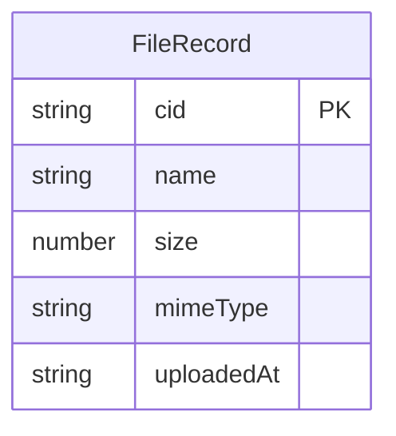

## 1. 架构设计

```mermaid
flowchart TD
    "Frontend (React + Vite)" -->|"HTTP API"| "Backend (Express + ipfs-http-client)"
    "Backend (Express + ipfs-http-client)" -->|"RPC"| "IPFS Node (Kubo)"
    "IPFS Node (Kubo)" -->|"P2P"| "IPFS Network"
    "Frontend (React + Vite)" -->|"Gateway URL"| "IPFS Gateway (ipfs.io)"
```

## 2. 技术说明

- 前端：React@18 + tailwindcss@3 + vite + zustand
- 初始化工具：vite-init (react-express-ts 模板)
- 后端：Express@4 + ipfs-http-client + multer
- 数据库：无（使用内存数组存储文件元数据，重启清空；持久化由 IPFS 网络保证）
- 外部服务：IPFS 节点（Kubo RPC，默认 http://127.0.0.1:5001），IPFS 公共网关（https://ipfs.io/ipfs/）

## 3. 路由定义

| 路由 | 用途 |
|------|------|
| / | 上传页面，拖拽上传文件至 IPFS |
| /library | 资源库页面，浏览已上传的文件列表 |

## 4. API 定义

### 4.1 上传文件

```
POST /api/upload
Content-Type: multipart/form-data
Body: file (文件)

Response 200:
{
  cid: string       // IPFS CID v0 或 v1
  name: string      // 原始文件名
  size: number      // 文件大小（字节）
  mimeType: string  // MIME 类型
}
```

### 4.2 获取文件流

```
GET /api/file/:cid
Response: 文件二进制流（Content-Type 根据 MIME 类型设置）
```

### 4.3 获取文件信息

```
GET /api/file/:cid/info
Response:
{
  cid: string
  name: string
  size: number
  mimeType: string
  uploadedAt: string  // ISO 时间戳
}
```

### 4.4 获取所有文件列表

```
GET /api/files
Response:
{
  files: Array<{
    cid: string
    name: string
    size: number
    mimeType: string
    uploadedAt: string
  }>
}
```

### 4.5 删除文件记录

```
DELETE /api/file/:cid
Response: { success: boolean }
```

## 5. 服务端架构图

```mermaid
flowchart LR
    "Controller (routes)" --> "Service (ipfs.service)" --> "IPFS Node"
    "Service (ipfs.service)" --> "Store (内存元数据)"
```

## 6. 数据模型

### 6.1 数据模型定义



### 6.2 数据定义

使用内存数组存储，无数据库表：

```typescript
interface FileRecord {
  cid: string
  name: string
  size: number
  mimeType: string
  uploadedAt: string
}
```
