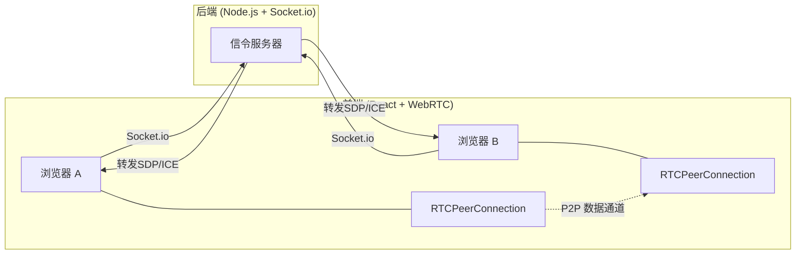

## 1. 架构设计



## 2. 技术说明
- 前端：React@18 + tailwindcss@3 + vite + TypeScript
- 初始化工具：vite-init
- 后端：Express@4 + Socket.io@4
- 数据库：无（纯实时通信，无持久化）

## 3. 路由定义
| 路由 | 用途 |
|------|------|
| / | 主页面，包含房间创建/加入和文件传输功能（单页应用） |

## 4. API 定义

### 4.1 Socket.io 事件定义

**客户端 → 服务器：**
| 事件名 | 数据结构 | 说明 |
|--------|----------|------|
| create-room | `{ roomId: string }` | 创建房间，服务器记录房间与 socket 映射 |
| join-room | `{ roomId: string }` | 加入房间，服务器通知房间内其他用户 |
| offer | `{ roomId: string, sdp: RTCSessionDescriptionInit }` | 发送 Offer SDP |
| answer | `{ roomId: string, sdp: RTCSessionDescriptionInit }` | 发送 Answer SDP |
| ice-candidate | `{ roomId: string, candidate: RTCIceCandidateInit }` | 发送 ICE Candidate |

**服务器 → 客户端：**
| 事件名 | 数据结构 | 说明 |
|--------|----------|------|
| room-created | `{ roomId: string }` | 房间创建成功 |
| peer-joined | `{ peerId: string }` | 对端加入房间 |
| offer | `{ sdp: RTCSessionDescriptionInit }` | 转发 Offer SDP |
| answer | `{ sdp: RTCSessionDescriptionInit }` | 转发 Answer SDP |
| ice-candidate | `{ candidate: RTCIceCandidateInit }` | 转发 ICE Candidate |
| peer-left | `{}` | 对端离开 |
| error | `{ message: string }` | 错误信息 |

### 4.2 WebRTC DataChannel 协议

文件传输消息格式：
```typescript
interface FileMeta {
  type: 'file-meta'
  fileId: string
  fileName: string
  fileSize: number
  fileType: string
}

interface FileChunk {
  type: 'file-chunk'
  fileId: string
  index: number
  data: ArrayBuffer
}

interface FileEnd {
  type: 'file-end'
  fileId: string
}
```

## 5. 服务器架构图

```mermaid
flowchart TD
    "Socket.io Server" --> "Room Manager"
    "Room Manager" --> "房间映射表 (roomId -> socketIds)"
    "Room Manager" --> "信令转发 (offer/answer/ice)"
```

## 6. 数据模型

不适用 — 本项目无数据库，房间信息仅存在于服务器内存中。
