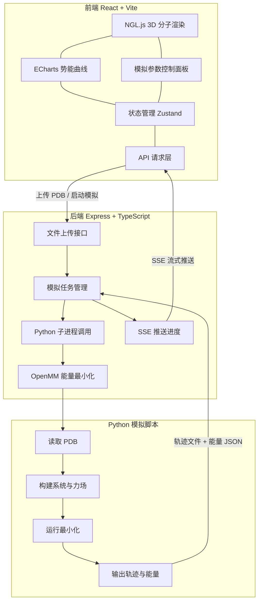
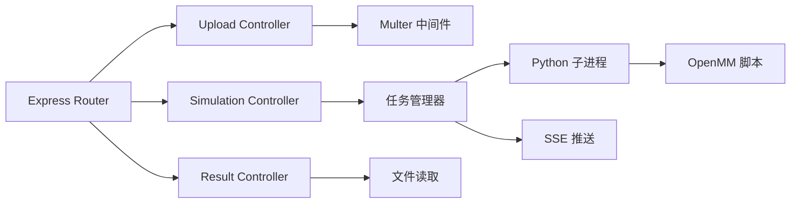
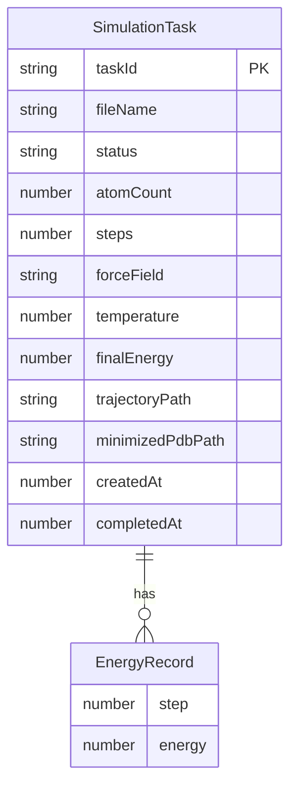

## 1. 架构设计



## 2. 技术说明

- **前端**：React@18 + TypeScript + Tailwind CSS@3 + Vite
- **初始化工具**：vite-init（react-express-ts 模板）
- **后端**：Express@4 + TypeScript（ESM 格式）
- **3D 渲染**：NGL Viewer（ngl@2，专为分子可视化设计的 WebGL 库）
- **图表**：ECharts@5（深色主题折线图，实时数据追加）
- **状态管理**：Zustand
- **分子模拟**：OpenMM（Python 库，通过 Node.js child_process 调用 Python 脚本）
- **文件上传**：multer（Express 中间件）
- **实时通信**：SSE（Server-Sent Events，推送模拟进度与能量数据）
- **数据库**：无（模拟结果以文件形式存储，任务状态存内存）

## 3. 路由定义

| 路由 | 用途 |
|------|------|
| `/` | 模拟工作台主页面，包含文件上传、3D 可视化、参数配置与势能图表 |
| `/results/:taskId` | 结果分析页面，轨迹回放与数据导出 |

## 4. API 定义

### 4.1 文件上传接口

```typescript
POST /api/upload
Content-Type: multipart/form-data

Request:
  file: PDB 文件（最大 10MB）

Response:
{
  taskId: string
  fileName: string
  atomCount: number
  residueCount: number
}
```

### 4.2 启动模拟接口

```typescript
POST /api/simulate
Content-Type: application/json

Request:
{
  taskId: string
  forceField: "AMBER14" | "CHARMM36" | "OPLS-AA"
  steps: number          // 能量最小化步数，默认 1000
  temperature: number    // 温度（K），默认 300
}

Response:
{
  taskId: string
  status: "running"
}
```

### 4.3 模拟进度 SSE 接口

```typescript
GET /api/simulate/:taskId/progress
Content-Type: text/event-stream

Event: progress
{
  step: number
  totalSteps: number
  potentialEnergy: number  // kJ/mol
  coordinates: number[][]  // 当前构象原子坐标（精简）
}

Event: complete
{
  taskId: string
  finalEnergy: number
  trajectoryFile: string   // 轨迹文件路径
}
```

### 4.4 获取模拟结果

```typescript
GET /api/results/:taskId

Response:
{
  taskId: string
  status: "completed"
  energies: { step: number; energy: number }[]
  trajectoryUrl: string
  pdbUrl: string
}
```

### 4.5 获取轨迹文件

```typescript
GET /api/trajectory/:taskId

Response: 二进制轨迹文件（DCD 格式）
```

### 4.6 获取最小化后的 PDB

```typescript
GET /api/minimized/:taskId

Response: PDB 文件内容（text/plain）
```

## 5. 服务器架构图



## 6. 数据模型

### 6.1 数据模型定义



### 6.2 数据定义

本项目不使用数据库，任务数据以内存 Map 存储，能量数据以 JSON 文件持久化。

```sql
-- 能量记录 JSON 文件结构
-- 存储路径: uploads/{taskId}/energies.json
{
  "taskId": "string",
  "records": [
    { "step": 0, "energy": 12345.67 },
    { "step": 1, "energy": 12340.12 }
  ]
}
```
