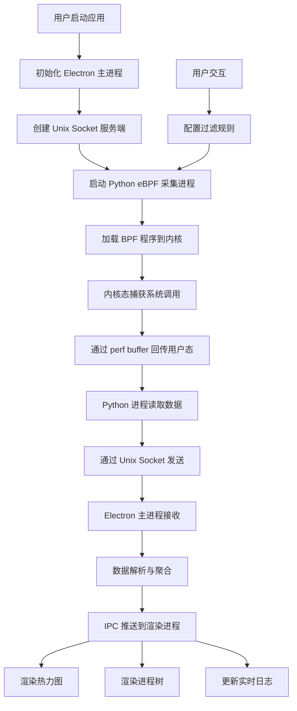

## 1. 产品概述

基于 eBPF 技术的内核级系统调用监控与可视化审计平台，通过在内核层实时捕获进程行为，为系统安全审计、性能分析和入侵检测提供直观的数据可视化支持。

- 主要用途：安全审计、系统性能分析、进程行为监控、入侵检测
- 目标用户：系统管理员、安全工程师、DevOps 工程师、性能优化工程师
- 产品价值：提供传统工具无法比拟的内核级监控能力，零侵入、高性能、实时性强

## 2. 核心功能

### 2.1 用户角色

| 角色 | 注册方法 | 核心权限 |
|------|----------|----------|
| 管理员 | 本地启动认证 | 启动/停止监控、配置系统调用过滤规则、导出审计日志 |
| 普通用户 | 本地启动 | 查看监控数据、浏览热力图和进程树、搜索历史记录 |

### 2.2 功能模块

1. **监控仪表盘**：实时系统调用统计、热力图展示、进程树视图、告警通知
2. **系统调用监控**：eBPF 数据采集、Unix Socket 数据传输、数据解析与存储
3. **热力图展示**：按时间/进程/调用类型三维展示系统调用频率
4. **进程树可视化**：展示进程调用关系、追踪 execve/fork 行为
5. **配置管理**：系统调用过滤规则、监控参数配置、数据导出

### 2.3 页面详情

| 页面名称 | 模块名称 | 功能描述 |
|---------|----------|----------|
| 监控仪表盘 | 统计概览 | 显示实时调用次数、活跃进程数、每秒调用速率、异常告警数 |
| 监控仪表盘 | 热力图组件 | 2D 热力图展示各时间点各系统调用的频率分布 |
| 监控仪表盘 | 进程树组件 | 可折叠的树形结构展示进程层级关系和调用链 |
| 监控仪表盘 | 实时日志流 | 滚动显示最新捕获的系统调用详细信息 |
| 配置页面 | 过滤规则 | 配置需要监控的系统调用列表（open, execve, read, write 等） |
| 配置页面 | 进程过滤 | 按进程名/ID 进行白名单或黑名单过滤 |
| 配置页面 | 数据导出 | 导出审计日志为 JSON/CSV 格式 |
| 详情弹窗 | 调用详情 | 展示单个系统调用的完整参数、返回值、时间戳、进程上下文 |

## 3. 核心流程

用户启动应用后，首先进入监控仪表盘，系统自动初始化 eBPF 探针开始捕获系统调用。采集到的原始数据通过 Unix Socket 发送到 Electron 主进程，主进程进行数据解析和聚合后推送到渲染进程。渲染进程实时更新热力图和进程树，用户可以点击热力图或进程节点查看详细信息，也可以通过配置页调整监控规则。

## 4. 用户界面设计

### 4.1 设计风格

- **设计方向**：赛博朋克/科技感深色主题，符合安全监控平台的专业定位
- **主色调**：深空蓝 `#0a0e17` 作为背景，搭配霓虹青 `#00f5d4` 作为主色
- **辅助色**：告警红 `#ff4757`、警告黄 `#ffa502`、成功绿 `#2ed573`、信息紫 `#a55eea`
- **字体**：展示字体使用 `JetBrains Mono`，正文字体使用 `Inter`，等宽字体使用 `Fira Code`
- **视觉效果**：矩阵代码雨背景、发光边框、数据流动画、扫描线效果
- **图标风格**：线性图标，发光效果，科技感十足

### 4.2 页面设计概述

| 页面名称 | 模块名称 | UI 元素 |
|---------|----------|---------|
| 监控仪表盘 | 统计概览 | 4个发光卡片，数字滚动动画，实时更新 |
| 监控仪表盘 | 热力图组件 | Canvas 绘制热力图，X轴时间、Y轴调用类型、颜色代表频率 |
| 监控仪表盘 | 进程树组件 | 可折叠树形结构，节点带状态颜色，连接线动画 |
| 监控仪表盘 | 实时日志流 | 终端风格输出，代码高亮，自动滚动，可暂停 |
| 配置页面 | 过滤规则 | 标签式选择器，开关按钮，自定义输入 |
| 配置页面 | 数据导出 | 文件选择器，进度条，完成提示 |
| 详情弹窗 | 调用详情 | 模态框，JSON 树状展示，参数高亮 |

### 4.3 响应式设计

- **桌面端优先**：主要针对 1920x1080 及以上分辨率设计
- **布局策略**：采用 CSS Grid 布局，热力图占主要区域（60%宽度），进程树占侧边栏（40%宽度）
- **自适应**：窗口缩小时自动调整布局，热力图和进程树改为上下排列
- **触控优化**：所有交互元素最小尺寸 44x44px，支持手势缩放热力图

### 4.4 动画与交互

- **页面加载**：数字从 0 滚动到目标值，卡片渐入动画
- **热力图更新**：新数据点淡入，颜色过渡平滑
- **进程树**：展开/折叠动画，节点点击发光效果
- **告警**：脉冲动画，边框闪烁，声音提示
- **鼠标悬停**：卡片上浮阴影增强，按钮发光
