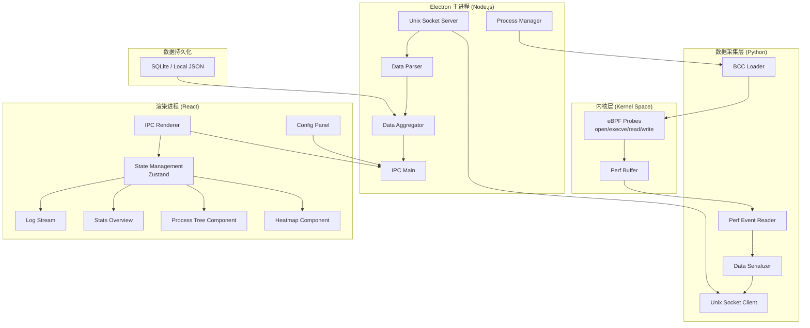

## 1. 架构设计



## 2. 技术描述

### 2.1 技术栈选型

| 层级 | 技术 | 版本 | 用途 |
|------|------|------|------|
| 内核层 | eBPF + BCC | 最新 | 内核态系统调用捕获 |
| 数据采集层 | Python | 3.10+ | BCC 绑定、数据预处理 |
| 桌面框架 | Electron | 28.x | 跨平台桌面应用 |
| 前端框架 | React | 18.x | UI 渲染 |
| 构建工具 | Vite | 5.x | 构建与开发服务器 |
| 样式框架 | TailwindCSS | 3.x | 样式系统 |
| 状态管理 | Zustand | 4.x | 全局状态管理 |
| 可视化 | Canvas API / D3.js | 7.x | 热力图和树图绘制 |
| IPC 通信 | Electron IPC | - | 主进程与渲染进程通信 |
| 进程通信 | Unix Domain Socket | - | Python 与 Node.js 通信 |
| 图表库 | recharts | 2.x | 统计图表 |

### 2.2 项目初始化

- 使用 `npm create vite@latest` 初始化 React 项目
- 集成 Electron 作为桌面容器
- 使用 `concurrently` 和 `wait-on` 管理多进程开发
- Python 部分独立管理，使用 `requirements.txt` 管理依赖

## 3. 目录结构

```
e:\soloM\m36
├── .trae/documents/          # 项目文档
├── src/
│   ├── main/                 # Electron 主进程
│   │   ├── index.ts          # 主进程入口
│   │   ├── socket.ts         # Unix Socket 服务端
│   │   ├── pythonManager.ts  # Python 进程管理
│   │   ├── dataAggregator.ts # 数据聚合器
│   │   └── ipcHandlers.ts    # IPC 处理器
│   ├── renderer/             # React 渲染进程
│   │   ├── main.tsx          # React 入口
│   │   ├── App.tsx           # 主应用组件
│   │   ├── store/            # 状态管理
│   │   │   └── useStore.ts   # Zustand store
│   │   ├── components/       # UI 组件
│   │   │   ├── Dashboard/    # 仪表盘
│   │   │   ├── Heatmap/      # 热力图
│   │   │   ├── ProcessTree/  # 进程树
│   │   │   ├── StatsCard/    # 统计卡片
│   │   │   ├── LogStream/    # 日志流
│   │   │   ├── ConfigPanel/  # 配置面板
│   │   │   └── common/       # 通用组件
│   │   ├── types/            # TypeScript 类型定义
│   │   └── utils/            # 工具函数
│   └── shared/               # 共享类型
├── ebpf/                     # eBPF 相关
│   ├── collector.py          # Python 采集程序
│   ├── bpf_program.c         # BPF C 代码
│   └── requirements.txt      # Python 依赖
├── electron.vite.config.ts   # Electron Vite 配置
├── tsconfig.json             # TypeScript 配置
├── tailwind.config.js        # Tailwind 配置
├── package.json              # 项目依赖
└── README.md                 # 项目说明
```

## 4. 路由定义

| 路由 | 页面 | 描述 |
|------|------|------|
| / | 监控仪表盘 | 主页面，包含热力图、进程树、统计概览、日志流 |
| /config | 配置页面 | 过滤规则配置、进程过滤、数据导出 |

## 5. 数据模型

### 5.1 系统调用事件数据结构

```typescript
interface SyscallEvent {
  timestamp: number;           // 时间戳 (ms)
  syscall: string;             // 系统调用名称
  pid: number;                 // 进程 ID
  ppid: number;                // 父进程 ID
  comm: string;                // 进程名
  uid: number;                 // 用户 ID
  gid: number;                 // 组 ID
  args: Record<string, any>;   // 系统调用参数
  retval: number;              // 返回值
  duration: number;            // 执行耗时 (ns)
}
```

### 5.2 进程节点数据结构

```typescript
interface ProcessNode {
  pid: number;
  ppid: number;
  name: string;
  cmdline: string;
  startTime: number;
  children: ProcessNode[];
  syscallCount: Record<string, number>;
  totalSyscalls: number;
}
```

### 5.3 热力图数据结构

```typescript
interface HeatmapDataPoint {
  timeBucket: number;          // 时间桶 (秒级)
  syscall: string;
  count: number;
  avgDuration: number;
}

interface HeatmapData {
  timeRange: [number, number];
  syscalls: string[];
  data: HeatmapDataPoint[];
}
```

### 5.4 配置数据结构

```typescript
interface AppConfig {
  monitoredSyscalls: string[];
  processWhitelist: string[];
  processBlacklist: string[];
  updateInterval: number;      // ms
  heatmapTimeWindow: number;   // 秒
  maxLogEntries: number;
  autoStart: boolean;
}
```

## 6. API 定义 (IPC)

### 6.1 主进程 → 渲染进程

```typescript
// 新的系统调用事件
ipcRenderer.on('syscall:event', (event: IpcRendererEvent, data: SyscallEvent) => void);

// 批量数据更新
ipcRenderer.on('syscall:batch', (event: IpcRendererEvent, data: SyscallEvent[]) => void);

// 热力图数据更新
ipcRenderer.on('heatmap:update', (event: IpcRendererEvent, data: HeatmapData) => void);

// 进程树更新
ipcRenderer.on('processtree:update', (event: IpcRendererEvent, data: ProcessNode) => void);

// 统计数据更新
ipcRenderer.on('stats:update', (event: IpcRendererEvent, data: StatsData) => void);

// 采集状态变化
ipcRenderer.on('collector:status', (event: IpcRendererEvent, data: CollectorStatus) => void);
```

### 6.2 渲染进程 → 主进程

```typescript
// 启动采集
ipcRenderer.invoke('collector:start', config: AppConfig): Promise<boolean>;

// 停止采集
ipcRenderer.invoke('collector:stop'): Promise<boolean>;

// 获取当前配置
ipcRenderer.invoke('config:get'): Promise<AppConfig>;

// 更新配置
ipcRenderer.invoke('config:set', config: AppConfig): Promise<boolean>;

// 导出数据
ipcRenderer.invoke('data:export', options: ExportOptions): Promise<string>;

// 获取采集状态
ipcRenderer.invoke('collector:status'): Promise<CollectorStatus>;
```

## 7. Unix Socket 通信协议

### 7.1 协议格式

使用 JSON 换行分隔符 (NDJSON) 协议：

```json
{"type":"event","data":{"timestamp":1700000000000,"syscall":"open","pid":1234,...}}
{"type":"event","data":{...}}
```

### 7.2 消息类型

| 类型 | 描述 |
|------|------|
| `handshake` | Python 进程连接初始化 |
| `event` | 单个系统调用事件 |
| `batch` | 批量事件 |
| `status` | 采集器状态报告 |
| `config` | 配置更新确认 |
| `error` | 错误通知 |

## 8. 核心算法与关键实现

### 8.1 eBPF 系统调用捕获

使用 BCC 的 `kprobe` 捕获系统调用入口和返回：

```c
// BPF C 代码片段
struct event_t {
    u64 timestamp;
    u32 pid;
    u32 ppid;
    char comm[16];
    char syscall[32];
    u64 args[6];
    s64 retval;
    u64 duration;
};

BPF_PERF_OUTPUT(events);
BPF_HASH(start, u32, u64);

int syscall_enter(struct pt_regs *ctx, ...) {
    u32 pid = bpf_get_current_pid_tgid() >> 32;
    u64 ts = bpf_ktime_get_ns();
    start.update(&pid, &ts);
    return 0;
}

int syscall_exit(struct pt_regs *ctx) {
    u32 pid = bpf_get_current_pid_tgid() >> 32;
    u64 *start_ts = start.lookup(&pid);
    if (start_ts) {
        struct event_t event = {};
        // 填充事件数据
        events.perf_submit(ctx, &event, sizeof(event));
        start.delete(&pid);
    }
    return 0;
}
```

### 8.2 热力图渲染算法

使用 Canvas 2D API 实现高性能热力图：

1. 时间分桶：将时间轴按 1 秒分桶
2. 调用类型映射：Y 轴映射不同系统调用
3. 颜色插值：根据调用次数使用 HSL 颜色空间插值
4. 性能优化：使用离屏 Canvas，只更新变化区域

### 8.3 进程树构建算法

1. 维护进程 Map：`Map<pid, ProcessNode>`
2. 每次 execve/fork 事件更新进程树
3. 递归构建树形结构，从 init 进程 (pid=1) 开始
4. 支持增量更新和全量重建

## 9. 性能优化策略

1. **内核层**：使用 BPF 哈希表在内核态过滤，减少用户态数据量
2. **数据采集层**：批量发送事件，降低 IPC 频率
3. **渲染层**：
   - 使用 `requestAnimationFrame` 批量渲染
   - 虚拟滚动处理大量日志
   - Canvas 局部重绘
   - Web Worker 处理数据聚合
4. **内存管理**：限制历史数据量，使用环形缓冲区
