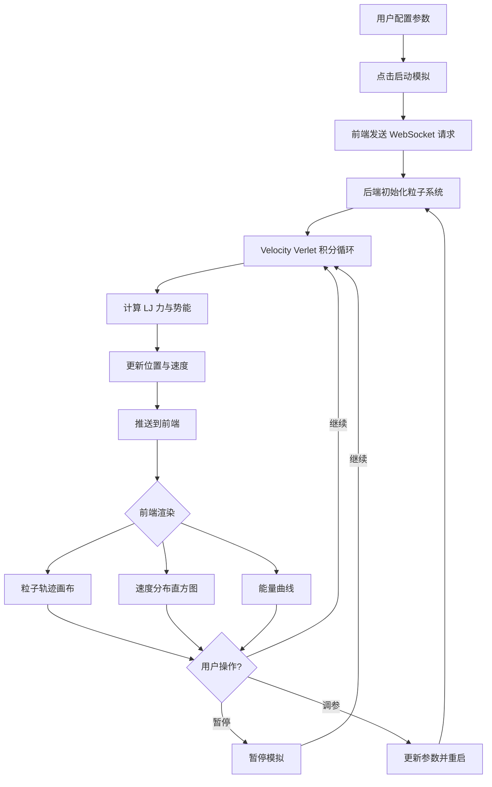

## 1. 产品概述

分子动力学模拟可视化平台——基于 Lennard-Jones 势能模型的科学计算工具，实时计算粒子轨迹并通过 WebSocket 推送至前端进行交互式可视化。

- 面向科研人员和学生，提供直观的分子动力学模拟体验
- 解决传统离线模拟无法实时观察粒子运动状态的问题，降低科学计算的学习门槛

## 2. 核心功能

### 2.1 用户角色

| 角色 | 注册方式 | 核心权限 |
|------|----------|----------|
| 普通用户 | 无需注册 | 使用模拟器、调整参数、查看可视化结果 |

### 2.2 功能模块

1. **模拟控制台**: 模拟参数配置、启动/暂停/重置控制、实时状态监控
2. **粒子轨迹可视化面板**: 2D 画布实时渲染粒子位置与运动轨迹
3. **速度分布分析面板**: 速度分布直方图与 Maxwell-Boltzmann 理论曲线对比
4. **系统状态面板**: 温度、动能、势能、总能量等热力学量实时曲线

### 2.3 页面详情

| 页面名称 | 模块名称 | 功能描述 |
|----------|----------|----------|
| 模拟控制台 | 参数面板 | 配置粒子数量、温度、密度、LJ 参数 (ε, σ)、时间步长 dt、截断半径 |
| 模拟控制台 | 控制按钮 | 启动/暂停/重置/单步模拟，显示当前步数与时间 |
| 模拟控制台 | 预设方案 | 提供气体/液体/固体三种预设参数方案快速切换 |
| 粒子轨迹可视化 | 2D 粒子画布 | D3.js SVG 实时绘制粒子位置，颜色映射速度大小，轨迹尾迹效果 |
| 粒子轨迹可视化 | 视图控制 | 缩放、平移、轨迹尾迹开关、速度色标图例 |
| 速度分布分析 | 直方图 | D3.js 绘制速度分量分布直方图 (Vx, Vy) 与速率分布 |
| 速度分布分析 | 理论曲线 | 叠加 Maxwell-Boltzmann 理论分布曲线对比 |
| 系统状态面板 | 能量曲线 | 实时绘制动能、势能、总能量随时间变化曲线 |
| 系统状态面板 | 热力学量 | 显示当前温度、压力、均方位移 (MSD) 等数值 |

## 3. 核心流程

用户打开平台后，选择预设方案或手动配置模拟参数，启动模拟后后端 Python 引擎开始计算 Lennard-Jones 粒子系统的运动轨迹，通过 WebSocket 实时推送粒子坐标数据至前端，前端 D3.js 组件接收数据后更新粒子画布、速度分布直方图和能量曲线，用户可随时暂停/调整参数/重置模拟。

## 4. 用户界面设计

### 4.1 设计风格

- **主色调**: 深色科研主题——深蓝灰底色 (#0a0e1a)，亮青色强调色 (#00e5ff)，粒子使用冷暖渐变色映射速度
- **次色调**: 深灰 (#1a1f2e) 卡片背景，(#2a3040) 边框，白色文字
- **按钮风格**: 圆角矩形，扁平化设计，主按钮亮青色填充，次按钮描边
- **字体**: JetBrains Mono (数据/代码区域) + Space Grotesk (标题/正文)
- **布局**: 左侧控制面板 + 中央大画布 + 右侧分析面板，三栏科学仪表板布局
- **图标风格**: 线性描边图标 (Phosphor Icons 风格)

### 4.2 页面设计概览

| 页面名称 | 模块名称 | UI 元素 |
|----------|----------|---------|
| 主界面 | 顶部导航栏 | Logo、平台名称、状态指示灯(绿/红/黄)、FPS 计数器 |
| 主界面 | 左侧参数面板 | 滑块(粒子数/温度/密度)、数值输入框(ε/σ/dt)、预设按钮组(气/液/固) |
| 主界面 | 左侧控制区 | 大号播放/暂停按钮、重置按钮、步进按钮、模拟步数/时间显示 |
| 主界面 | 中央粒子画布 | SVG 画布占主要区域、粒子圆点(颜色映射速度)、轨迹尾迹线、坐标轴标注 |
| 主界面 | 右上速度分布 | 直方图条形、理论曲线叠加、Vx/Vy/速率 Tab 切换、颜色映射色标 |
| 主界面 | 右下能量曲线 | 三条曲线(动能/势能/总能量)、图例、时间轴滚动窗口 |
| 主界面 | 底部状态栏 | 粒子数、当前温度、步数、WebSocket 连接状态 |

### 4.3 响应式

- 桌面优先设计，三栏布局在 ≥1200px 下完整展示
- 1024-1200px: 左侧面板可折叠，中右两栏并排
- <1024px: 单栏堆叠布局，面板通过抽屉式切换

### 4.4 3D 场景指引

不适用，本项目为 2D 可视化。
