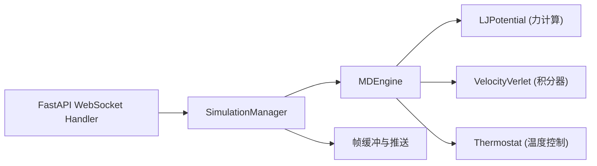
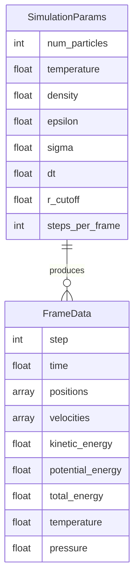

## 1. 架构设计

```mermaid
graph TB
    subgraph "前端层 (React + D3.js)"
        A["模拟控制面板"] --> WS["WebSocket Client"]
        B["粒子轨迹画布 (D3.js SVG)"]
        C["速度分布直方图 (D3.js)"]
        D["能量曲线 (D3.js)"]
    end

    subgraph "后端层 (Python FastAPI)"
        WS --> API["WebSocket Endpoint"]
        API --> SIM["MD 模拟引擎"]
        SIM --> LJ["Lennard-Jones 势能计算"]
        SIM --> VV["Velocity Verlet 积分器"]
        SIM --> INIT["粒子初始化器"]
        API --> PARAM["参数管理器"]
    end

    subgraph "数据层"
        SIM --> DATA["帧数据 (坐标/速度/能量)"]
    end

    WS -->|"推送帧数据"| B
    WS -->|"推送帧数据"| C
    WS -->|"推送帧数据"| D
```



## 2. 技术说明

- **前端**: React@18 + D3.js@7 + TailwindCSS@3 + Vite
- **初始化工具**: Vite (create-vite)
- **后端**: Python FastAPI + Uvicorn (WebSocket 支持)
- **科学计算**: NumPy (数组计算) + SciPy (空间距离计算优化)
- **数据库**: 无 (纯内存计算，实时推送)

## 3. 路由定义

| 路由 | 用途 |
|------|------|
| `/` | 主页面——模拟控制台 + 粒子可视化 + 分析面板 |
| `/ws/simulate` | WebSocket 端点——实时推送模拟帧数据 |

## 4. API 定义

### 4.1 WebSocket 消息协议

**客户端 → 服务端 (请求)**

```typescript
type ClientMessage =
  | { type: "start"; params: SimulationParams }
  | { type: "pause" }
  | { type: "resume" }
  | { type: "reset" }
  | { type: "step" }
  | { type: "update_params"; params: Partial<SimulationParams> };

interface SimulationParams {
  num_particles: number;      // 粒子数量 (10-500)
  temperature: number;        // 初始温度 (kT 单位)
  density: number;            // 粒子密度 (ρ*)
  epsilon: number;            // LJ 势阱深度 (ε)
  sigma: number;              // LJ 粒子直径 (σ)
  dt: number;                 // 时间步长
  r_cutoff: number;           // 截断半径
  steps_per_frame: number;    // 每帧计算步数
}
```

**服务端 → 客户端 (响应)**

```typescript
type ServerMessage =
  | { type: "frame"; data: FrameData }
  | { type: "status"; data: StatusData }
  | { type: "error"; message: string };

interface FrameData {
  step: number;
  time: number;
  positions: [number, number][];   // 粒子坐标 [x, y]
  velocities: [number, number][];  // 粒子速度 [vx, vy]
  kinetic_energy: number;
  potential_energy: number;
  total_energy: number;
  temperature: number;
  pressure: number;
}

interface StatusData {
  status: "running" | "paused" | "idle" | "error";
  step: number;
  fps: number;
}
```

## 5. 服务器架构图



## 6. 数据模型

### 6.1 核心数据模型



### 6.2 Lennard-Jones 势能模型

$$V(r) = 4\varepsilon \left[ \left(\frac{\sigma}{r}\right)^{12} - \left(\frac{\sigma}{r}\right)^{6} \right]$$

- 使用 Velocity Verlet 算法进行时间积分
- 最小镜像约定处理周期性边界条件
- 截断半径优化 (r_cutoff = 2.5σ)
- Berendsen 恒温器可选控温
