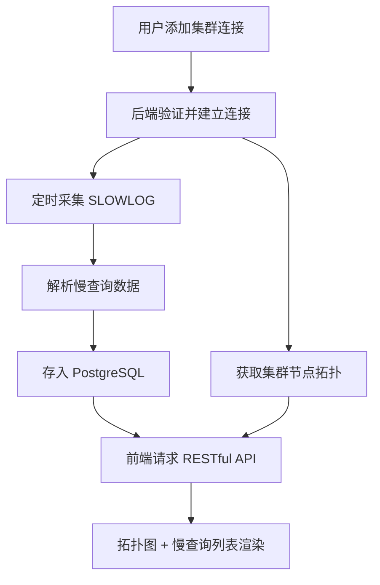

## 1. 产品概述

分布式 Redis 集群可视化管理与慢查询分析平台，面向运维工程师和开发人员，提供 Redis Cluster 集群状态的实时监控、节点健康拓扑可视化、慢查询自动采集与统计分析能力。解决多实例 Redis 集群管理中信息分散、慢查询排查困难的问题。

## 2. 核心功能

### 2.1 用户角色

| 角色 | 注册方式 | 核心权限 |
|------|----------|----------|
| 运维工程师 | 系统分配 | 管理集群连接、查看拓扑、分析慢查询 |
| 开发人员 | 系统分配 | 查看拓扑、查询慢日志统计 |

### 2.2 功能模块

1. **仪表盘页面**：集群概览统计、节点健康状态总览、慢查询趋势图
2. **集群拓扑页面**：ECharts 力导向拓扑图展示集群节点与主从关系、节点状态实时标注
3. **慢查询分析页面**：慢查询列表、多维度筛选、耗时分布统计、命令类型占比

### 2.3 页面详情

| 页面名称 | 模块名称 | 功能描述 |
|----------|----------|----------|
| 仪表盘 | 集群概览卡片 | 展示已连接集群数、总节点数、在线节点数、告警节点数 |
| 仪表盘 | 慢查询趋势图 | 近 24 小时慢查询数量折线图 |
| 仪表盘 | 最近慢查询快览 | 展示最近 10 条慢查询摘要 |
| 集群拓扑 | 拓扑关系图 | ECharts 力导向图展示集群节点，主从关系用连线标注，节点颜色反映健康状态 |
| 集群拓扑 | 节点详情面板 | 点击节点展示详细信息（角色、内存、连接数、延迟） |
| 慢查询分析 | 筛选栏 | 按集群、节点、命令类型、时间范围、耗时阈值筛选 |
| 慢查询分析 | 慢查询列表 | 表格展示慢查询详情（命令、耗时、时间戳、节点） |
| 慢查询分析 | 耗时分布图 | 柱状图展示慢查询耗时区间分布 |
| 慢查询分析 | 命令类型饼图 | 饼图展示各命令类型占比 |

## 3. 核心流程

用户注册集群连接信息 → 后端建立 Redis Cluster 连接 → 定时轮询各节点 SLOWLOG → 解析并存入 PostgreSQL → 前端通过 API 查询拓扑与慢查询数据 → 可视化展示

## 4. 用户界面设计

### 4.1 设计风格

- **主色调**：深色科技感主题，主色 #00D4AA（青绿），辅助色 #FF6B6B（告警红）、#4A90D9（信息蓝）
- **背景**：深色渐变 #0D1117 → #161B22，搭配微妙网格纹理
- **字体**：标题使用 JetBrains Mono（等宽科技感），正文使用 Noto Sans SC
- **按钮**：圆角 8px，轻微发光效果，hover 时亮度提升
- **布局**：左侧导航栏 + 右侧内容区，卡片式模块布局
- **图标**：Lucide Icons 线性图标

### 4.2 页面设计概览

| 页面名称 | 模块名称 | UI 元素 |
|----------|----------|---------|
| 仪表盘 | 集群概览卡片 | 4 个统计卡片（暗色玻璃态），数字动画计数 |
| 仪表盘 | 慢查询趋势图 | ECharts 折线图，青绿渐变填充区域 |
| 仪表盘 | 最近慢查询快览 | 紧凑表格，耗时高亮色阶 |
| 集群拓扑 | 拓扑关系图 | ECharts 力导向图，绿色=在线、红色=离线、黄色=告警，连线表示主从 |
| 集群拓扑 | 节点详情面板 | 右侧滑出抽屉面板，展示节点指标 |
| 慢查询分析 | 筛选栏 | 下拉选择器 + 日期范围 + 耗时滑块 |
| 慢查询分析 | 慢查询列表 | 深色表格，行 hover 发光，耗时列色阶渐变 |
| 慢查询分析 | 耗时分布图 | ECharts 柱状图 |
| 慢查询分析 | 命令类型饼图 | ECharts 环形饼图 |

### 4.3 响应式

- 桌面优先设计，最小宽度 1280px
- 平板端拓扑图可缩放平移
- 表格支持横向滚动
