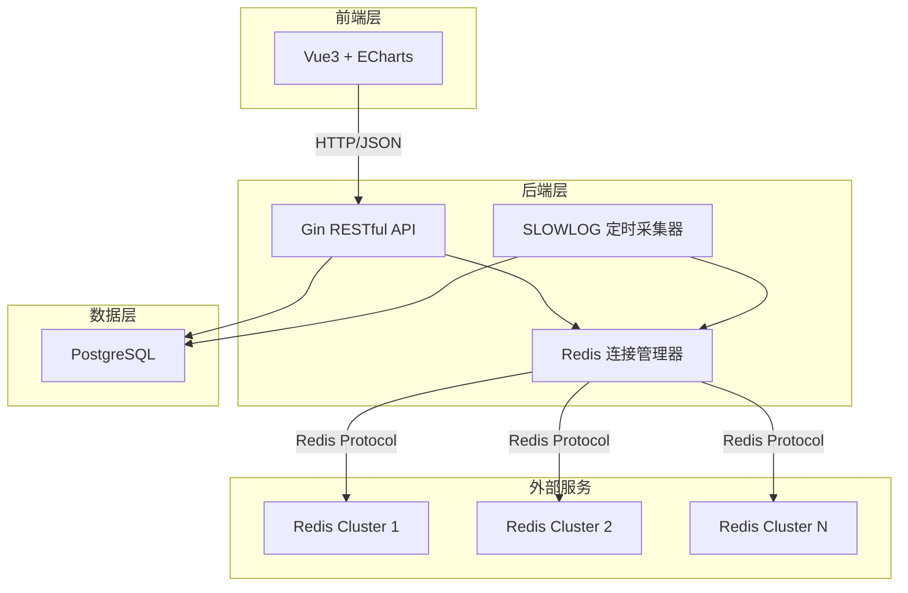
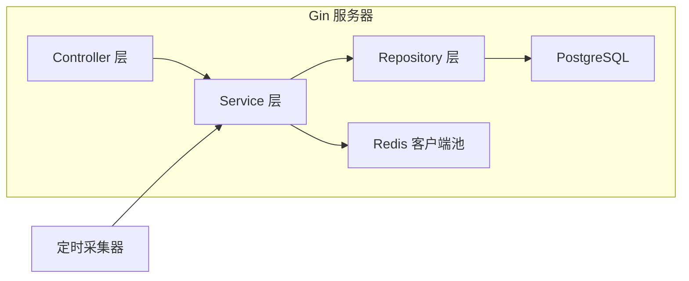
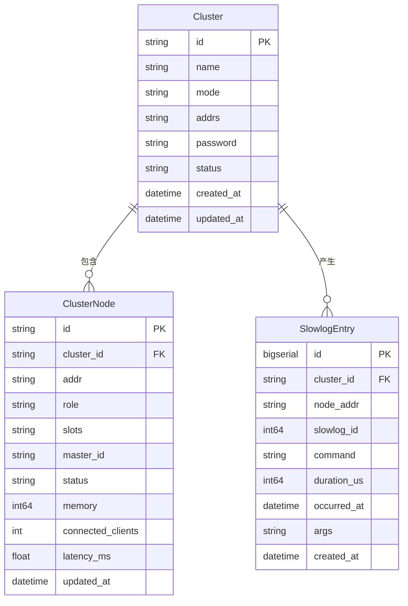

## 1. 架构设计



## 2. 技术说明

- **前端**：Vue3 + TypeScript + Vite + TailwindCSS + ECharts
- **前端初始化工具**：vite-init（vue-ts 模板）
- **后端**：Go 1.22 + Gin + go-redis/v9 + GORM
- **数据库**：PostgreSQL 16
- **项目结构**：前后端分离，前端在 `web/` 目录，后端在 `server/` 目录

## 3. 路由定义

| 路由 | 用途 |
|------|------|
| `/` | 仪表盘页面，集群概览与慢查询趋势 |
| `/topology` | 集群拓扑页面，节点健康度可视化 |
| `/slowlog` | 慢查询分析页面，列表与统计 |

## 4. API 定义

### 4.1 集群管理

```
POST   /api/clusters              创建集群连接
GET    /api/clusters              获取所有集群列表
GET    /api/clusters/:id          获取集群详情
DELETE /api/clusters/:id          删除集群连接
GET    /api/clusters/:id/nodes    获取集群节点拓扑信息
GET    /api/clusters/:id/health   获取集群健康状态
```

### 4.2 慢查询

```
GET    /api/slowlogs              查询慢日志列表（支持分页、筛选）
GET    /api/slowlogs/stats        慢查询统计（趋势、分布、命令占比）
GET    /api/slowlogs/trend        慢查询趋势数据
GET    /api/slowlogs/distribution 慢查询耗时分布
GET    /api/slowlogs/commands     慢查询命令类型统计
```

### 4.3 仪表盘

```
GET    /api/dashboard/overview    集群概览统计
GET    /api/dashboard/recent      最近慢查询
```

### 4.4 TypeScript 类型定义

```typescript
interface Cluster {
  id: string
  name: string
  mode: "cluster" | "standalone"
  addrs: string[]
  password?: string
  status: "online" | "offline" | "partial"
  nodeCount: number
  createdAt: string
}

interface ClusterNode {
  id: string
  clusterId: string
  addr: string
  role: "master" | "slave"
  slots?: string
  masterId?: string
  status: "online" | "offline" | "fail"
  memory: number
  connectedClients: number
  latencyMs: number
}

interface SlowlogEntry {
  id: number
  clusterId: string
  nodeAddr: string
  command: string
  durationUs: number
  timestamp: string
  args?: string
}

interface SlowlogStats {
  total: number
  avgDurationUs: number
  maxDurationUs: number
  commandDistribution: { command: string; count: number }[]
  durationDistribution: { range: string; count: number }[]
  trend: { time: string; count: number }[]
}

interface DashboardOverview {
  clusterCount: number
  totalNodes: number
  onlineNodes: number
  alertNodes: number
  slowlogCount24h: number
}
```

## 5. 服务器架构图



## 6. 数据模型

### 6.1 数据模型定义



### 6.2 数据定义语言

```sql
CREATE TABLE clusters (
    id UUID PRIMARY KEY DEFAULT gen_random_uuid(),
    name VARCHAR(128) NOT NULL,
    mode VARCHAR(16) NOT NULL DEFAULT 'cluster',
    addrs TEXT NOT NULL,
    password TEXT,
    status VARCHAR(16) NOT NULL DEFAULT 'offline',
    created_at TIMESTAMPTZ NOT NULL DEFAULT NOW(),
    updated_at TIMESTAMPTZ NOT NULL DEFAULT NOW()
);

CREATE TABLE cluster_nodes (
    id UUID PRIMARY KEY DEFAULT gen_random_uuid(),
    cluster_id UUID NOT NULL REFERENCES clusters(id) ON DELETE CASCADE,
    addr VARCHAR(64) NOT NULL,
    role VARCHAR(16) NOT NULL DEFAULT 'master',
    slots TEXT,
    master_id VARCHAR(64),
    status VARCHAR(16) NOT NULL DEFAULT 'online',
    memory BIGINT DEFAULT 0,
    connected_clients INT DEFAULT 0,
    latency_ms FLOAT DEFAULT 0,
    updated_at TIMESTAMPTZ NOT NULL DEFAULT NOW(),
    UNIQUE(cluster_id, addr)
);

CREATE TABLE slowlog_entries (
    id BIGSERIAL PRIMARY KEY,
    cluster_id UUID NOT NULL REFERENCES clusters(id) ON DELETE CASCADE,
    node_addr VARCHAR(64) NOT NULL,
    slowlog_id BIGINT NOT NULL,
    command VARCHAR(256) NOT NULL,
    duration_us BIGINT NOT NULL,
    occurred_at TIMESTAMPTZ NOT NULL,
    args TEXT,
    created_at TIMESTAMPTZ NOT NULL DEFAULT NOW()
);

CREATE INDEX idx_slowlog_cluster ON slowlog_entries(cluster_id);
CREATE INDEX idx_slowlog_occurred ON slowlog_entries(occurred_at DESC);
CREATE INDEX idx_slowlog_command ON slowlog_entries(command);
CREATE INDEX idx_slowlog_duration ON slowlog_entries(duration_us DESC);
CREATE INDEX idx_nodes_cluster ON cluster_nodes(cluster_id);
```
