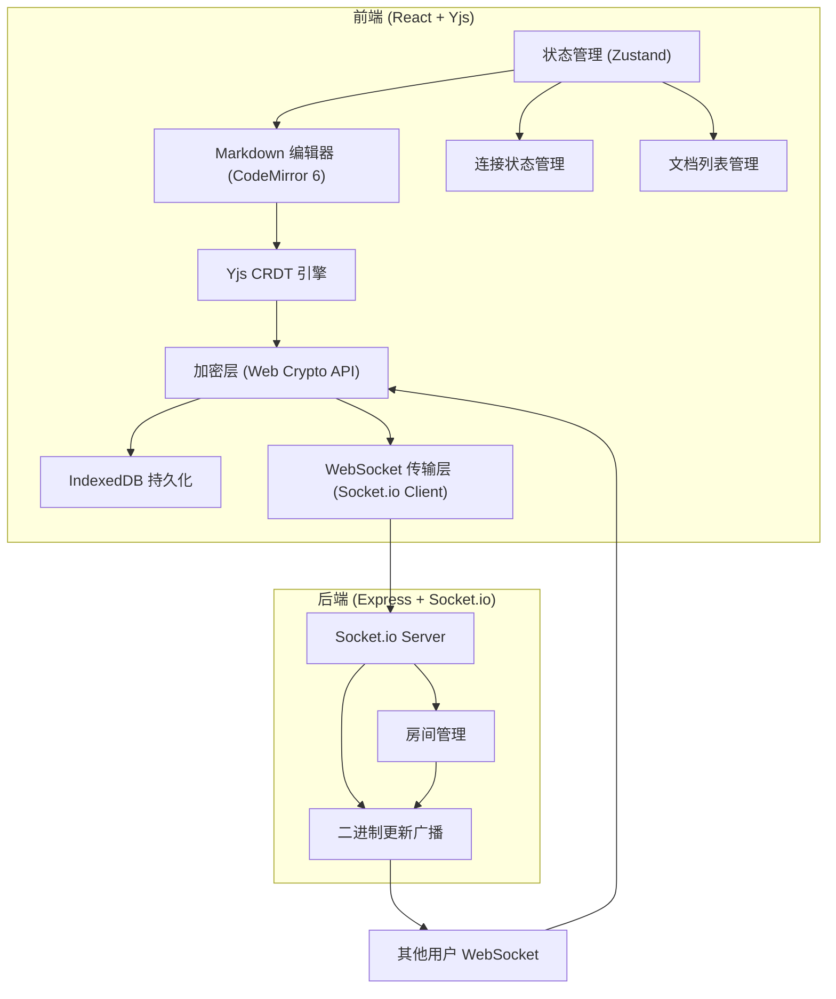
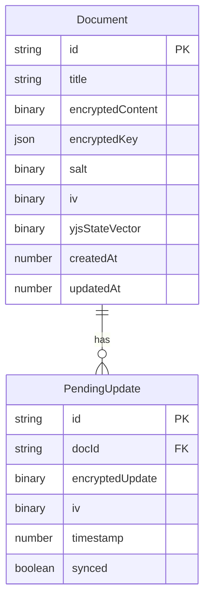

## 1. 架构设计



## 2. 技术说明

- **前端**: React@18 + TypeScript + TailwindCSS@3 + Vite
- **CRDT 引擎**: Yjs（yjs 库 + y-codemirror.next 绑定）
- **编辑器**: CodeMirror 6（@codemirror/view + @codemirror/state + markdown 语言支持）
- **本地存储**: IndexedDB（通过 idb 包装库）
- **状态管理**: Zustand
- **加密**: Web Crypto API（AES-GCM 对称加密 + PBKDF2 密钥派生）
- **实时通信**: Socket.io Client/Server（传输 Uint8Array 二进制更新）
- **后端**: Express@4 + Socket.io（仅做消息中转，不存储任何业务数据）
- **初始化工具**: vite-init (react-express-ts 模板)

## 3. 路由定义

| 路由 | 用途 |
|------|------|
| `/` | 文档管理页面 — 文档列表、新建、密钥管理 |
| `/editor/:docId` | 编辑器页面 — Markdown 协作编辑、实时预览 |
| `/room` | 房间页面 — 创建/加入协作房间 |

## 4. API 定义

### 4.1 WebSocket 事件（Socket.io）

```typescript
interface ServerToClientEvents {
  "room:joined": (data: { roomId: string; members: Member[] }) => void;
  "room:member_joined": (data: { member: Member }) => void;
  "room:member_left": (data: { memberId: string }) => void;
  "doc:update": (data: { docId: string; update: Uint8Array; from: string }) => void;
  "doc:sync_request": (data: { docId: string; stateVector: Uint8Array }) => void;
  "doc:sync_response": (data: { docId: string; diff: Uint8Array }) => void;
}

interface ClientToServerEvents {
  "room:join": (data: { roomId: string; username: string }) => void;
  "room:leave": (data: { roomId: string }) => void;
  "doc:update": (data: { docId: string; update: Uint8Array }) => void;
  "doc:sync_request": (data: { docId: string; stateVector: Uint8Array }) => void;
}

interface Member {
  id: string;
  username: string;
  color: string;
  cursorPosition?: number;
}
```

### 4.2 加密接口定义

```typescript
interface CryptoService {
  deriveKey(password: string, salt: Uint8Array): Promise<CryptoKey>;
  encrypt(data: Uint8Array, key: CryptoKey): Promise<EncryptedPayload>;
  decrypt(payload: EncryptedPayload, key: CryptoKey): Promise<Uint8Array>;
  generateSalt(): Uint8Array;
  exportKey(key: CryptoKey): Promise<JsonWebKey>;
  importKey(jwk: JsonWebKey): Promise<CryptoKey>;
}

interface EncryptedPayload {
  ciphertext: Uint8Array;
  iv: Uint8Array;
  salt: Uint8Array;
}
```

### 4.3 IndexedDB 数据模型

```typescript
interface DocumentRecord {
  id: string;
  title: string;
  encryptedContent: Uint8Array;
  encryptedKey: JsonWebKey;
  salt: Uint8Array;
  iv: Uint8Array;
  yjsStateVector: Uint8Array;
  createdAt: number;
  updatedAt: number;
}

interface PendingUpdateRecord {
  id: string;
  docId: string;
  encryptedUpdate: Uint8Array;
  iv: Uint8Array;
  timestamp: number;
  synced: boolean;
}
```

## 5. 服务端架构图

```mermaid
flowchart LR
    "Socket.io Controller" --> "Room Service"
    "Room Service" --> "Room Store (内存 Map)"
    "Socket.io Controller" --> "Broadcast Service"
    "Broadcast Service" --> "Socket.io Emit"
```

后端不使用数据库，所有房间信息存储在内存中（Map 数据结构），服务器重启后房间信息清空。客户端负责持久化所有数据。

## 6. 数据模型

### 6.1 前端 IndexedDB 数据模型



### 6.2 后端内存数据结构

```typescript
interface RoomStore {
  rooms: Map<string, {
    id: string;
    members: Map<string, Member>;
    createdAt: number;
  }>;
}
```

### 6.3 关键技术决策

1. **Yjs CRDT**：选择 Yjs 作为 CRDT 引擎，因其成熟的生态系统和对离线协作的优秀支持。Yjs 的增量更新（Update）机制天然适合二进制传输和加密。
2. **AES-GCM 加密**：使用 AES-256-GCM 对称加密保护文档内容，提供机密性和完整性保证。每次加密生成随机 IV，防止密文分析。
3. **PBKDF2 密钥派生**：从用户密码派生 AES 密钥，使用 600,000 次迭代增强抗暴力破解能力。
4. **IndexedDB 持久化**：存储加密后的 Yjs 文档状态和未同步的增量更新，确保离线编辑数据不丢失。
5. **离线更新队列**：离线期间的 Yjs 更新以 EncryptedPayload 形式存入 PendingUpdate 表，上线后按时间戳顺序发送，确保 CRDT 合并正确性。
6. **Socket.io 二进制传输**：利用 Socket.io 的二进制事件支持，直接传输 Uint8Array，避免 Base64 编码的性能开销。
