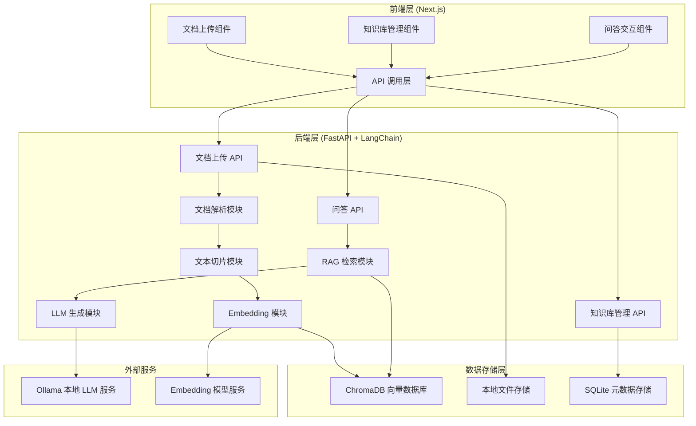
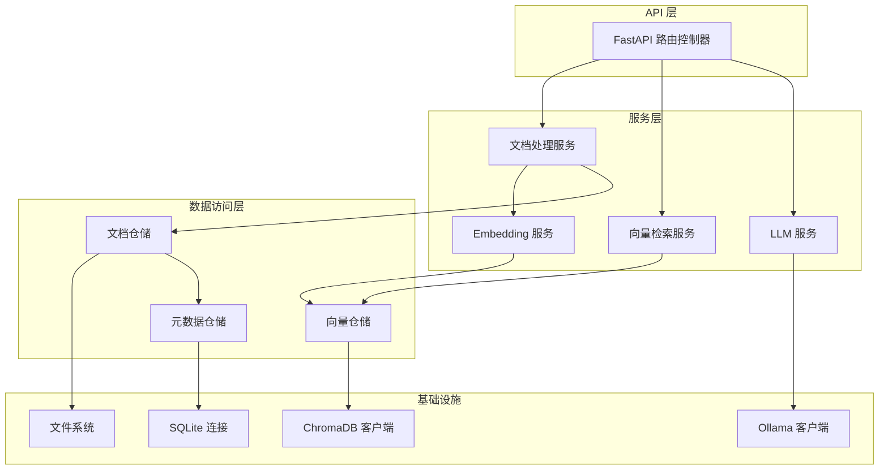
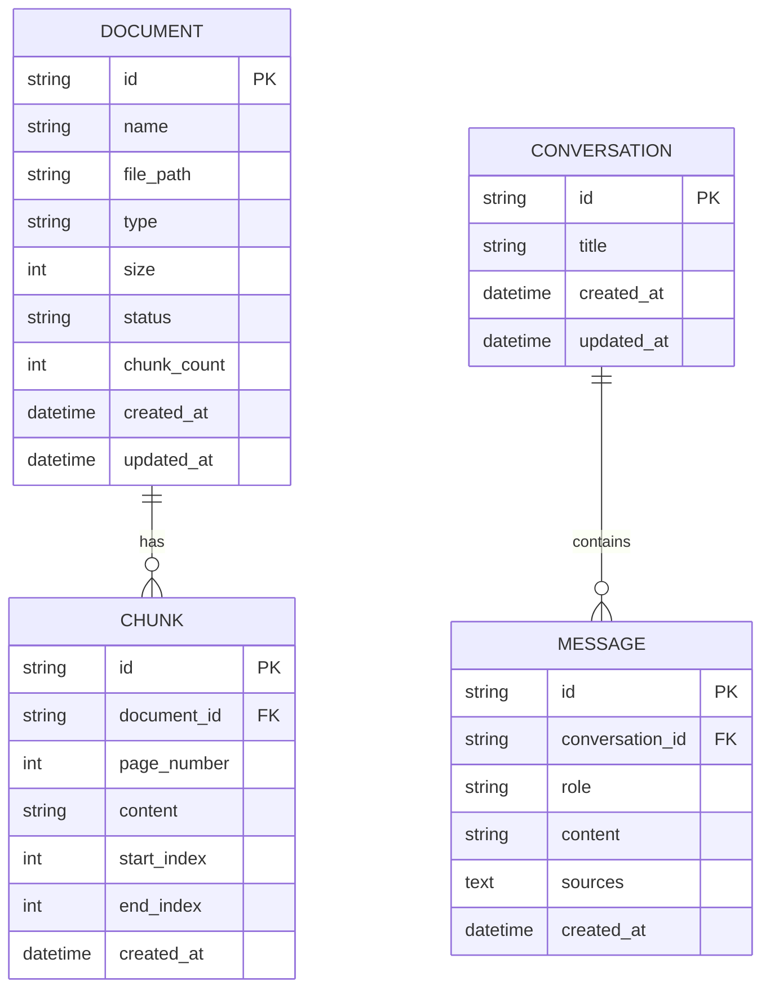

## 1. 架构设计



## 2. 技术栈说明

### 2.1 前端技术栈
- **框架**: Next.js 14 (App Router) + React 18
- **语言**: TypeScript
- **样式**: TailwindCSS 3
- **状态管理**: Zustand
- **HTTP 客户端**: Axios
- **图标库**: Lucide React
- **Markdown 渲染**: react-markdown + react-syntax-highlighter
- **动画**: framer-motion

### 2.2 后端技术栈
- **Web 框架**: FastAPI
- **AI 框架**: LangChain
- **文档解析**: PyPDF2, python-docx
- **向量数据库**: ChromaDB
- **Embedding 模型**: sentence-transformers (all-MiniLM-L6-v2)
- **LLM 集成**: Ollama (支持 Llama 3, Mistral, Qwen 等本地模型)
- **文本切片**: LangChain RecursiveCharacterTextSplitter

### 2.3 数据存储
- **向量数据**: ChromaDB (本地持久化)
- **文件存储**: 本地文件系统 (./data/documents)
- **元数据**: SQLite (SQLAlchemy ORM)

## 3. 路由定义

| 路由 | 页面/用途 |
|------|----------|
| `/` | 首页 / 问答交互页面 |
| `/upload` | 文档上传页面 |
| `/knowledge` | 知识库管理页面 |

## 4. API 定义

### 4.1 TypeScript 类型定义

```typescript
// 文档信息
interface Document {
  id: string;
  name: string;
  size: number;
  type: 'pdf' | 'txt';
  uploadTime: string;
  status: 'uploading' | 'processing' | 'completed' | 'failed';
  chunkCount: number;
}

// 文档上传响应
interface UploadResponse {
  success: boolean;
  document: Document;
}

// 问答请求
interface ChatRequest {
  question: string;
  conversationId?: string;
}

// 问答响应
interface ChatResponse {
  answer: string;
  sources: Source[];
  conversationId: string;
}

// 参考来源
interface Source {
  id: string;
  documentName: string;
  pageNumber?: number;
  content: string;
  score: number;
}

// 处理进度
interface ProcessProgress {
  documentId: string;
  stage: 'parsing' | 'chunking' | 'embedding' | 'storing';
  progress: number;
  total: number;
}
```

### 4.2 后端 API 端点

| 方法 | 路径 | 描述 |
|------|------|------|
| POST | `/api/documents/upload` | 上传文档 |
| GET | `/api/documents` | 获取文档列表 |
| DELETE | `/api/documents/{id}` | 删除文档 |
| POST | `/api/documents/{id}/reindex` | 重新索引文档 |
| POST | `/api/chat` | 发送问题获取回答 |
| GET | `/api/chat/{conversationId}` | 获取对话历史 |
| GET | `/api/health` | 健康检查 |
| GET | `/api/models` | 获取可用模型列表 |

## 5. 后端架构图



## 6. 数据模型

### 6.1 ER 图



### 6.2 数据库 DDL

```sql
-- 文档表
CREATE TABLE documents (
    id VARCHAR(36) PRIMARY KEY,
    name VARCHAR(255) NOT NULL,
    file_path VARCHAR(500) NOT NULL,
    type VARCHAR(10) NOT NULL,
    size INTEGER NOT NULL,
    status VARCHAR(20) NOT NULL DEFAULT 'uploading',
    chunk_count INTEGER DEFAULT 0,
    created_at DATETIME DEFAULT CURRENT_TIMESTAMP,
    updated_at DATETIME DEFAULT CURRENT_TIMESTAMP
);

-- 文档切片表
CREATE TABLE chunks (
    id VARCHAR(36) PRIMARY KEY,
    document_id VARCHAR(36) NOT NULL,
    page_number INTEGER,
    content TEXT NOT NULL,
    start_index INTEGER,
    end_index INTEGER,
    created_at DATETIME DEFAULT CURRENT_TIMESTAMP,
    FOREIGN KEY (document_id) REFERENCES documents(id) ON DELETE CASCADE
);

-- 对话表
CREATE TABLE conversations (
    id VARCHAR(36) PRIMARY KEY,
    title VARCHAR(255),
    created_at DATETIME DEFAULT CURRENT_TIMESTAMP,
    updated_at DATETIME DEFAULT CURRENT_TIMESTAMP
);

-- 消息表
CREATE TABLE messages (
    id VARCHAR(36) PRIMARY KEY,
    conversation_id VARCHAR(36) NOT NULL,
    role VARCHAR(20) NOT NULL,
    content TEXT NOT NULL,
    sources TEXT,
    created_at DATETIME DEFAULT CURRENT_TIMESTAMP,
    FOREIGN KEY (conversation_id) REFERENCES conversations(id) ON DELETE CASCADE
);

-- 索引
CREATE INDEX idx_chunks_document_id ON chunks(document_id);
CREATE INDEX idx_messages_conversation_id ON messages(conversation_id);
CREATE INDEX idx_documents_status ON documents(status);
```
