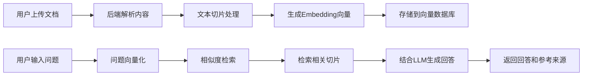

## 1. 产品概述

私有知识库 RAG 问答助手是一个基于检索增强生成技术的智能问答系统，允许用户上传个人文档（PDF/TXT），系统自动处理并建立索引，用户可以通过自然语言提问获取基于文档内容的精准回答。

- **核心价值**：帮助用户快速从个人文档库中检索信息，结合 LLM 生成精准回答
- **目标用户**：需要管理和查询大量文档的研究者、学生、知识工作者
- **解决痛点**：传统搜索无法理解语义，人工查阅效率低下

## 2. 核心功能

### 2.1 用户角色

| 角色 | 注册方式 | 核心权限 |
|------|----------|----------|
| 普通用户 | 无需注册，本地使用 | 上传文档、管理知识库、问答交互 |

### 2.2 功能模块

1. **文档上传页**：支持 PDF/TXT 格式文档上传，显示上传进度和处理状态
2. **知识库管理页**：查看已上传文档列表，支持删除和重新索引
3. **问答交互页**：用户提问、显示回答、展示参考来源

### 2.3 页面详情

| 页面名称 | 模块名称 | 功能描述 |
|----------|----------|----------|
| 文档上传页 | 上传区域 | 拖拽或点击上传 PDF/TXT 文件，显示文件列表和处理状态 |
| 文档上传页 | 进度指示 | 显示文档解析、切片、向量化的进度 |
| 知识库管理页 | 文档列表 | 展示已上传文档的名称、大小、上传时间、切片数量 |
| 知识库管理页 | 操作按钮 | 删除文档、重新生成索引 |
| 问答交互页 | 聊天界面 | 多轮对话，支持追问，显示参考文档片段 |
| 问答交互页 | 来源展示 | 高亮显示回答引用的文档片段和页码 |

## 3. 核心流程

用户上传文档 → 后端解析文档内容 → 文本切片处理 → 生成 Embedding 向量 → 存储到向量数据库 → 用户输入问题 → 问题向量化 → 相似度检索相关切片 → 结合 LLM 生成回答 → 返回回答和参考来源

## 4. 用户界面设计

### 4.1 设计风格

- **主色调**：深科技蓝 (#165DFF) 作为主色，搭配深灰色背景，营造专业感
- **辅助色**：青色 (#00B42A) 表示成功状态，橙色 (#FF7D00) 表示处理中
- **按钮风格**：圆角矩形，轻微阴影，悬停时有缩放和颜色加深效果
- **字体**：使用 JetBrains Mono 作为代码和展示字体，Inter 作为正文字体
- **布局风格**：三栏布局（左侧导航、中间主内容、右侧参考来源），卡片式设计
- **图标风格**：使用 Lucide 图标库，线性风格，统一 24px 尺寸

### 4.2 页面设计概述

| 页面名称 | 模块名称 | UI 元素 |
|----------|----------|----------|
| 文档上传页 | 上传区域 | 大面积虚线边框拖拽区域，文件图标动画，进度条渐变动画 |
| 知识库管理页 | 文档列表 | 卡片网格布局，悬停时显示操作按钮，状态标签动画 |
| 问答交互页 | 聊天界面 | 消息气泡区分用户和 AI，打字机效果显示回答，代码高亮 |
| 问答交互页 | 参考来源 | 可折叠面板，高亮引用片段，链接到原文位置 |

### 4.3 响应式设计

- 桌面端：三栏布局，左侧导航 240px，中间内容自适应，右侧参考面板 320px
- 平板端：两栏布局，右侧参考面板变为底部抽屉
- 移动端：单栏布局，导航变为底部 Tab 栏，参考来源嵌入回答下方

### 4.4 交互动效

- 页面加载：元素渐入动画，导航栏从左侧滑入
- 上传交互：拖拽时边框变色，文件图标弹跳动画
- 问答交互：AI 回答打字机效果，思考中状态动画
- 参考来源：展开/折叠平滑过渡，引用高亮闪烁效果
