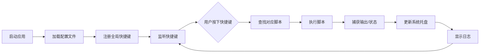
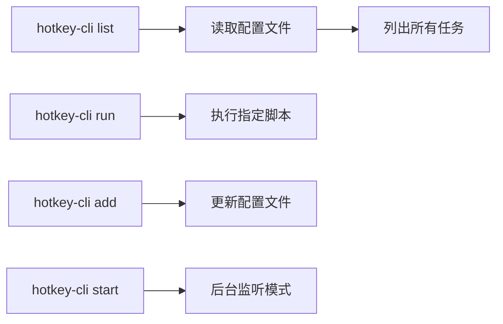

## 1. 产品概述

HotkeyRunner 是一款基于 Rust + Tauri 开发的桌面自动化工具，允许用户通过自定义全局快捷键组合触发预设的 Shell 或 Python 脚本，并在系统托盘实时显示执行日志。同时提供 CLI 命令行工具，支持在无 GUI 的服务器环境中通过配置文件管理自动化任务。

- 解决问题：提升工作效率，通过快捷键快速执行重复性任务；支持服务器环境下的自动化任务管理
- 目标用户：开发者、运维人员、需要自动化工作流的办公人员
- 产品价值：跨平台（Windows/macOS/Linux）、高性能（Rust 后端）、轻量级、可配置

## 2. 核心功能

### 2.1 用户角色

| 角色 | 使用场景 | 核心权限 |
|------|----------|----------|
| 桌面用户 | 日常办公、开发工作 | 创建/编辑快捷键配置、执行脚本、查看执行日志 |
| 服务器管理员 | 无 GUI 服务器环境 | 通过 CLI 管理配置文件、启停自动化任务 |

### 2.2 功能模块

1. **桌面 GUI 应用**：快捷键管理、脚本配置、日志查看、系统托盘
2. **全局快捷键监听**：监听用户自定义快捷键组合，触发对应脚本
3. **脚本执行引擎**：支持 Shell 和 Python 脚本执行，捕获输出和状态
4. **系统托盘**：显示执行状态、快速访问日志、应用控制
5. **CLI 命令行工具**：配置管理、任务执行、状态查询（无 GUI 环境）

### 2.3 页面详情

| 页面名称 | 模块名称 | 功能描述 |
|-----------|-------------|---------------------|
| 主界面 | 快捷键列表 | 展示所有已配置的快捷键及其关联脚本，支持增删改查 |
| 主界面 | 脚本编辑器 | 内置代码编辑器，支持编辑 Shell/Python 脚本 |
| 主界面 | 日志面板 | 实时显示脚本执行输出、状态、时间戳 |
| 主界面 | 设置面板 | 应用配置、启动项设置、主题切换 |
| 系统托盘 | 快捷菜单 | 快速执行脚本、查看最近日志、退出应用 |
| 系统托盘 | 状态指示 | 通过图标/tooltip 显示当前运行状态 |

## 3. 核心流程

### 3.1 桌面端使用流程

### 3.2 CLI 使用流程

## 4. 用户界面设计

### 4.1 设计风格

- **主色调**：深色主题，以深蓝色 (#1e293b) 为主背景，配合青色 (#06b6d4) 作为强调色
- **按钮风格**：圆角矩形，悬停时有微妙的阴影和颜色变化
- **字体**：使用 JetBrains Mono 作为代码字体，Inter 作为界面字体
- **布局风格**：侧边栏导航 + 主内容区，卡片式布局
- **图标风格**：使用 lucide-react 图标库，统一线性风格

### 4.2 页面设计概述

| 页面名称 | 模块名称 | UI 元素 |
|-----------|-------------|-------------|
| 主界面 | 快捷键列表 | 数据表格、搜索框、新增按钮、操作列（编辑/删除/运行） |
| 主界面 | 脚本编辑器 | 代码编辑器（语法高亮）、行号、保存按钮、运行按钮 |
| 主界面 | 日志面板 | 日志条目（时间戳、状态、输出内容）、滚动条、清空按钮 |
| 主界面 | 设置面板 | 开关组件、下拉选择、输入框、保存按钮 |
| 系统托盘 | 快捷菜单 | 菜单项、分隔线、状态指示器 |

### 4.3 响应性

- 桌面端优先设计，主窗口固定最小尺寸 800x600
- 支持窗口拖拽调整大小，内容区域自适应
- 系统托盘菜单在所有平台保持一致体验

### 4.4 交互设计

- 快捷键配置时提供实时录制功能，用户可直接按下组合键进行配置
- 脚本执行时提供实时输出流显示，支持 ANSI 颜色
- 日志条目根据执行状态显示不同颜色（成功-绿色、失败-红色、运行中-黄色）
- 系统托盘图标在脚本执行时显示动画效果

---

**文档版本**: v1.0  
**创建日期**: 2026-05-29
