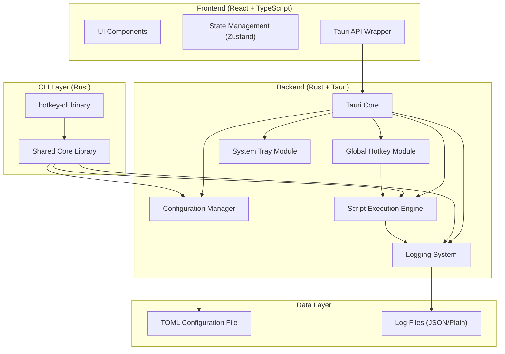

## 1. 架构设计



## 2. 技术栈描述

### 2.1 整体架构
采用前后端分离的混合架构，Rust 作为核心后端处理系统级操作，React 作为前端提供用户界面，两者通过 Tauri 进行 IPC 通信。核心逻辑抽离为独立库，供 GUI 和 CLI 共享使用。

### 2.2 技术选型

| 层级 | 技术 | 版本 | 用途 |
|------|------|------|------|
| 前端框架 | React | ^18.3 | UI 组件库 |
| 前端语言 | TypeScript | ^5.4 | 类型安全 |
| 构建工具 | Vite | ^5.2 | 构建和开发服务器 |
| 样式框架 | Tailwind CSS | ^3.4 | 原子化 CSS |
| 状态管理 | Zustand | ^4.5 | 前端状态管理 |
| 图标库 | lucide-react | ^0.378 | 图标组件 |
| 代码编辑器 | @uiw/react-codemirror | ^4.22 | 脚本编辑 |
| 桌面框架 | Tauri | ^2.0 | 桌面应用框架 |
| 后端语言 | Rust | ^1.77 | 系统级编程 |
| 全局快捷键 | global-hotkey | ^0.5 | Tauri 官方快捷键库 |
| 配置解析 | serde + toml | ^1.0 | TOML 配置文件解析 |
| 进程管理 | tokio | ^1.37 | 异步运行时 |
| CLI 框架 | clap | ^4.5 | 命令行参数解析 |
| 日志框架 | tracing | ^0.1 | 结构化日志 |

## 3. 项目结构

```
hotkey-runner/
├── src/                          # 前端代码
│   ├── components/               # React 组件
│   │   ├── HotkeyList.tsx       # 快捷键列表
│   │   ├── ScriptEditor.tsx     # 脚本编辑器
│   │   ├── LogPanel.tsx         # 日志面板
│   │   ├── Settings.tsx         # 设置面板
│   │   └── Sidebar.tsx          # 侧边栏
│   ├── store/                    # 状态管理
│   │   └── useAppStore.ts       # Zustand store
│   ├── types/                    # TypeScript 类型定义
│   │   └── index.ts
│   ├── utils/                    # 工具函数
│   │   ├── tauriApi.ts          # Tauri API 封装
│   │   └── formatters.ts
│   ├── App.tsx                   # 主应用组件
│   ├── main.tsx                  # 入口文件
│   └── index.css                 # 全局样式
├── src-tauri/                    # Rust 后端代码
│   ├── Cargo.toml               # Rust 依赖
│   ├── tauri.conf.json          # Tauri 配置
│   ├── src/
│   │   ├── main.rs              # Tauri 入口
│   │   ├── lib.rs               # 核心库入口
│   │   ├── config/              # 配置管理
│   │   │   ├── mod.rs
│   │   │   ├── models.rs
│   │   │   └── manager.rs
│   │   ├── hotkey/              # 快捷键管理
│   │   │   ├── mod.rs
│   │   │   └── listener.rs
│   │   ├── script/              # 脚本执行
│   │   │   ├── mod.rs
│   │   │   ├── engine.rs
│   │   │   └── shell.rs
│   │   ├── tray/                # 系统托盘
│   │   │   ├── mod.rs
│   │   │   └── menu.rs
│   │   ├── logger/              # 日志系统
│   │   │   ├── mod.rs
│   │   │   └── collector.rs
│   │   ├── cli/                 # CLI 工具
│   │   │   ├── mod.rs
│   │   │   ├── commands.rs
│   │   │   └── main.rs
│   │   └── commands.rs          # Tauri IPC 命令
│   └── icons/                   # 应用图标
├── shared/                       # 共享类型定义
│   └── types.ts
├── package.json                  # npm 依赖
├── tsconfig.json                 # TypeScript 配置
├── vite.config.ts                # Vite 配置
├── tailwind.config.js            # Tailwind 配置
└── README.md
```

## 4. 核心数据模型

### 4.1 配置文件结构 (TOML)

```toml
[general]
auto_start = false
log_retention_days = 7
theme = "dark"

[[tasks]]
name = "deploy-server"
description = "部署生产服务器"
hotkey = "Ctrl+Shift+D"
script_type = "shell"
script_path = "./scripts/deploy.sh"
working_dir = "/home/user/project"
enabled = true

[tasks.env]
NODE_ENV = "production"
API_KEY = "xxx"

[[tasks]]
name = "backup-db"
description = "备份数据库"
hotkey = "Ctrl+Alt+B"
script_type = "python"
script_path = "./scripts/backup.py"
working_dir = "/home/user"
enabled = true
```

### 4.2 TypeScript 类型定义

```typescript
export interface TaskConfig {
  name: string;
  description: string;
  hotkey: string;
  script_type: 'shell' | 'python';
  script_path: string;
  script_content?: string;
  working_dir: string;
  enabled: boolean;
  env?: Record<string, string>;
}

export interface LogEntry {
  id: string;
  task_name: string;
  timestamp: string;
  level: 'info' | 'warn' | 'error' | 'success';
  message: string;
  exit_code?: number;
}

export interface ExecutionState {
  task_name: string;
  status: 'idle' | 'running' | 'success' | 'failed';
  started_at?: string;
  finished_at?: string;
  output: string;
  exit_code?: number;
}

export interface AppConfig {
  general: {
    auto_start: boolean;
    log_retention_days: number;
    theme: 'light' | 'dark';
  };
  tasks: TaskConfig[];
}
```

### 4.3 Rust 数据模型

```rust
// src-tauri/src/config/models.rs
use serde::{Deserialize, Serialize};

#[derive(Debug, Serialize, Deserialize, Clone)]
pub struct AppConfig {
    pub general: GeneralConfig,
    pub tasks: Vec<Task>,
}

#[derive(Debug, Serialize, Deserialize, Clone)]
pub struct GeneralConfig {
    pub auto_start: bool,
    pub log_retention_days: i32,
    pub theme: String,
}

#[derive(Debug, Serialize, Deserialize, Clone)]
pub struct Task {
    pub name: String,
    pub description: String,
    pub hotkey: String,
    pub script_type: ScriptType,
    pub script_path: String,
    pub working_dir: String,
    pub enabled: bool,
    pub env: Option<std::collections::HashMap<String, String>>,
}

#[derive(Debug, Serialize, Deserialize, Clone)]
#[serde(rename_all = "lowercase")]
pub enum ScriptType {
    Shell,
    Python,
}
```

## 5. Tauri IPC 命令定义

```typescript
// 前端调用后端的命令
export const TauriCommands = {
  // 配置管理
  getConfig: () => invoke<AppConfig>('get_config'),
  saveConfig: (config: AppConfig) => invoke<void>('save_config', { config }),
  
  // 任务管理
  getTasks: () => invoke<TaskConfig[]>('get_tasks'),
  addTask: (task: TaskConfig) => invoke<void>('add_task', { task }),
  updateTask: (task: TaskConfig) => invoke<void>('update_task', { task }),
  deleteTask: (name: string) => invoke<void>('delete_task', { name }),
  runTask: (name: string) => invoke<ExecutionState>('run_task', { name }),
  stopTask: (name: string) => invoke<void>('stop_task', { name }),
  
  // 快捷键管理
  registerHotkey: (hotkey: string, taskName: string) => invoke<void>('register_hotkey', { hotkey, taskName }),
  unregisterHotkey: (hotkey: string) => invoke<void>('unregister_hotkey', { hotkey }),
  
  // 日志管理
  getLogs: (taskName?: string, limit?: number) => invoke<LogEntry[]>('get_logs', { taskName, limit }),
  clearLogs: () => invoke<void>('clear_logs'),
  
  // 应用控制
  showMainWindow: () => invoke<void>('show_main_window'),
  hideMainWindow: () => invoke<void>('hide_main_window'),
}

// 后端向前端发送的事件
export const TauriEvents = {
  LOG_ENTRY: 'log-entry',
  EXECUTION_STATE_CHANGED: 'execution-state-changed',
  HOTKEY_PRESSED: 'hotkey-pressed',
}
```

## 6. CLI 命令定义

```
hotkey-cli <COMMAND>

Commands:
  list      列出所有已配置的任务
  add       添加新任务
  remove    删除任务
  run       执行指定任务
  start     启动后台监听模式（监听快捷键）
  stop      停止后台监听
  status    查看当前运行状态
  logs      查看执行日志
  config    管理配置文件
  help      显示帮助信息

Options:
  -c, --config <FILE>  指定配置文件路径
  -h, --help           显示帮助
  -V, --version        显示版本
```

## 7. 关键技术实现

### 7.1 全局快捷键监听
使用 Tauri 官方 `global-hotkey` 插件，支持跨平台全局快捷键注册和监听。快捷键字符串格式遵循 `modifiers+key` 规范，如 `Ctrl+Shift+A`。

### 7.2 脚本执行引擎
- 使用 `tokio::process::Command` 异步执行子进程
- 实时捕获 stdout/stderr 输出流
- 支持设置工作目录和环境变量
- 提供进程终止功能
- 捕获退出码和执行时间

### 7.3 日志系统
- 使用 `tracing` 进行结构化日志记录
- 日志同时输出到文件和前端界面
- 支持按任务过滤和时间范围查询
- 自动清理过期日志

### 7.4 配置管理
- 使用 TOML 格式存储配置，人类可读
- 配置文件默认路径：
  - Windows: `%APPDATA%\HotkeyRunner\config.toml`
  - macOS: `~/Library/Application Support/HotkeyRunner/config.toml`
  - Linux: `~/.config/hotkey-runner/config.toml`
- 支持配置热加载

---

**文档版本**: v1.0  
**创建日期**: 2026-05-29
