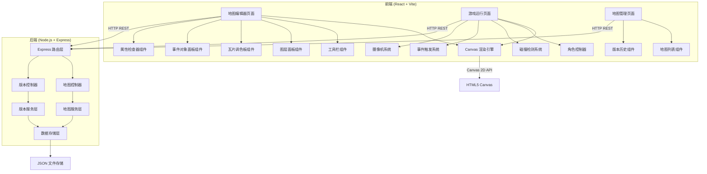
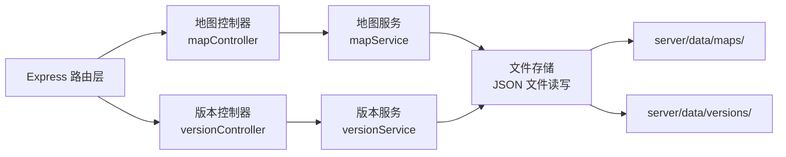
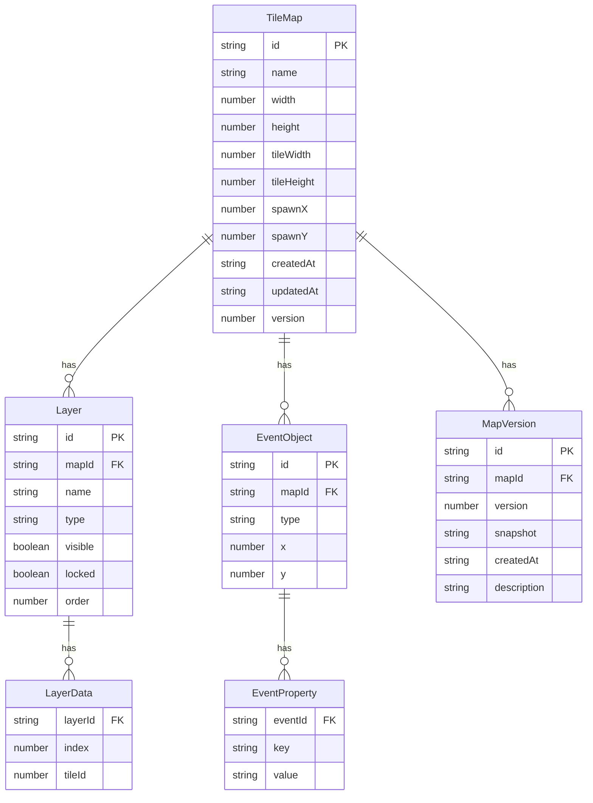

## 1. 架构设计



## 2. 技术说明

- **前端**：React@18 + TypeScript + Tailwind CSS@3 + Vite
- **初始化工具**：Vite（`npm create vite@latest`）
- **后端**：Express@4 + TypeScript
- **数据库**：JSON 文件存储（低门槛，无需数据库服务），数据目录 `server/data/`
- **Canvas 渲染**：原生 HTML5 Canvas 2D API，不依赖第三方渲染库
- **状态管理**：React Context + useReducer（编辑器状态），无需引入 Redux
- **路由**：React Router@6
- **HTTP 客户端**：fetch（原生），封装为 api 模块

## 3. 路由定义

| 路由 | 用途 |
|------|------|
| `/` | 地图管理首页，展示地图列表 |
| `/editor/:mapId` | 地图编辑器页面（编辑模式 + 运行模式切换） |
| `/play/:mapId` | 独立游戏运行页面（全屏游玩） |

## 4. API 定义

### 4.1 地图 API

```typescript
interface TileMap {
  id: string
  name: string
  width: number
  height: number
  tileWidth: number
  tileHeight: number
  layers: Layer[]
  events: EventObject[]
  spawnPoint: { x: number; y: number }
  createdAt: string
  updatedAt: string
  version: number
}

interface Layer {
  id: string
  name: string
  type: "terrain" | "collision" | "event"
  visible: boolean
  locked: boolean
  data: number[]
  order: number
}

interface EventObject {
  id: string
  type: "teleport" | "npc" | "chest" | "trigger"
  x: number
  y: number
  properties: Record<string, string>
}

interface MapVersion {
  id: string
  mapId: string
  version: number
  snapshot: TileMap
  createdAt: string
  description: string
}

// GET /api/maps - 获取地图列表
// Response: { maps: TileMap[] }

// GET /api/maps/:id - 获取地图详情
// Response: TileMap

// POST /api/maps - 创建地图
// Body: { name: string; width: number; height: number; tileWidth: number; tileHeight: number }
// Response: TileMap

// PUT /api/maps/:id - 更新地图
// Body: Partial<TileMap>
// Response: TileMap

// DELETE /api/maps/:id - 删除地图
// Response: { success: boolean }

// POST /api/maps/:id/duplicate - 复制地图
// Response: TileMap

// GET /api/maps/:id/versions - 获取版本历史
// Response: { versions: MapVersion[] }

// POST /api/maps/:id/versions - 创建版本快照
// Body: { description: string }
// Response: MapVersion

// POST /api/maps/:id/versions/:versionId/rollback - 回滚到指定版本
// Response: TileMap

// POST /api/maps/import - 导入地图 JSON
// Body: { data: TileMap }
// Response: TileMap

// GET /api/maps/:id/export - 导出地图 JSON
// Response: TileMap
```

## 5. 服务端架构图



## 6. 数据模型

### 6.1 数据模型定义



### 6.2 数据存储结构

```
server/data/
├── maps/
│   ├── map-001.json       # 单个地图完整数据
│   └── map-002.json
└── versions/
    ├── map-001/
    │   ├── v1.json        # 版本快照
    │   └── v2.json
    └── map-002/
        └── v1.json
```

每个地图 JSON 文件包含完整的 TileMap 结构（含 layers.data 数组和 events 数组），版本快照为同一结构的深拷贝。
