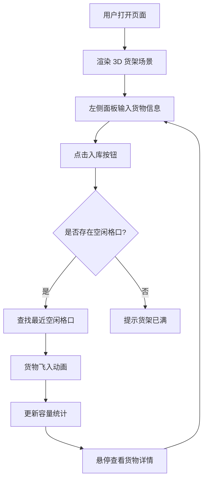

## 1. 产品概述

3D 仓库货架容量模拟器 — 一个基于 Three.js 的交互式 3D 可视化仓库管理系统，用户可通过表单输入货物信息，实现货物自动入库到 10×10 货架格口，并实时查看货物详情与货架容量状态。

- 目标用户：仓储管理人员、物流规划师、仓库设计工程师
- 核心价值：直观可视化仓库空间利用率，提升仓储管理效率

## 2. 核心功能

### 2.1 用户角色

| 角色 | 注册方式 | 核心权限 |
|------|----------|----------|
| 仓库管理员 | 无需注册 | 入库操作、查看货物详情、查看容量统计 |

### 2.2 功能模块

1. **仓库主页**：3D 货架场景渲染、货物入库操作、悬停详情查看、容量统计

### 2.3 页面详情

| 页面名称 | 模块名称 | 功能描述 |
|----------|----------|----------|
| 仓库主页 | 3D 货架场景 | 使用 Three.js 渲染 10×10 货架格口，支持轨道控制旋转/缩放/平移 |
| 仓库主页 | 左侧入库面板 | 表单输入货物名称、尺寸（长宽高）、数量，点击"入库"按钮执行入库 |
| 仓库主页 | 货物飞入动画 | 货物从场景外飞入最近的空闲格口，带有平滑缓动动画 |
| 仓库主页 | 悬停详情 | 鼠标悬停在货物立方体上显示货物名称、尺寸、入库时间等信息 |
| 仓库主页 | 容量统计 | 显示已用格口数/总格口数、空间利用率百分比 |

## 3. 核心流程

用户打开页面 → 查看 3D 货架场景 → 在左侧面板输入货物信息（名称、尺寸、数量）→ 点击"入库"→ 系统自动寻找最近的空闲格口 → 货物以飞入动画进入格口 → 鼠标悬停查看货物详情 → 继续入库或旋转查看

## 4. 用户界面设计

### 4.1 设计风格

- 主色调：工业深蓝 (#1a2744) + 金属银灰 (#8b95a5)
- 强调色：霓虹青绿 (#00e5a0) 用于交互反馈和入库动画
- 货架颜色：深灰金属质感 (#3a3f47)
- 货物颜色：根据尺寸大小渐变 — 小件青绿、中件琥珀橙、大件珊瑚红
- 字体：JetBrains Mono（数据面板）+ Noto Sans SC（中文界面）
- 布局：左侧 320px 固定面板 + 右侧 3D 场景占满剩余空间
- 按钮风格：圆角矩形 + 霓虹青绿描边 + hover 发光效果
- 图标风格：线性 lucide 图标

### 4.2 页面设计概览

| 页面名称 | 模块名称 | UI 元素 |
|----------|----------|----------|
| 仓库主页 | 左侧面板 | 深色半透明背景、毛玻璃效果、表单输入框、入库按钮、容量进度条 |
| 仓库主页 | 3D 场景 | 深色环境光、货架金属材质、货物彩色立方体、格口边框线框 |
| 仓库主页 | 悬停提示 | 毛玻璃浮窗、货物名称/尺寸/时间/格口编号 |
| 仓库主页 | 容量统计 | 环形进度条、数字显示已用/总数、百分比 |

### 4.3 响应式

- 桌面优先设计，最低支持 1280px 宽度
- 3D 场景自适应窗口大小
- 左侧面板可折叠以增加 3D 视图面积

### 4.4 3D 场景指导

- 环境：深色工业风仓库氛围，微弱环境光 + 顶部聚光灯
- 灯光设置：一个 AmbientLight (0x334455, 0.6) + 两个 DirectionalLight (0xffffff, 0.8) 从不同角度照射
- 相机设置：PerspectiveCamera，初始位置 (15, 12, 20)，朝向货架中心 (0, 2.5, 0)
- 交互：OrbitControls 支持旋转/缩放/平移，鼠标悬停 raycasting 检测货物
- 动画：货物飞入使用 TWEEN 缓动动画 (Easing.Quadratic.Out)
- 货架结构：5 层 × 2 列 = 10 行，每行 10 个格口，共 100 个格口
