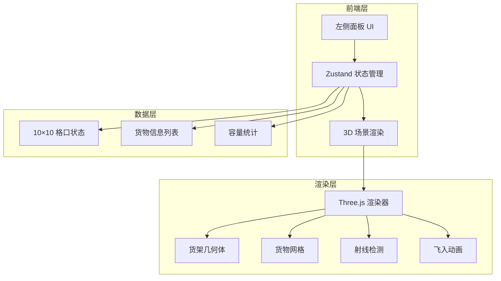
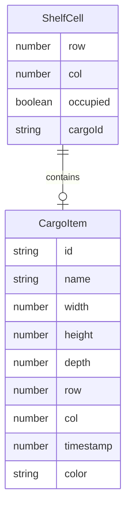

## 1. 架构设计



## 2. 技术说明

- 前端：React@18 + TypeScript + tailwindcss@3 + Vite
- 初始化工具：vite-init
- 后端：无
- 数据库：无，使用 Zustand 内存状态管理
- 3D 渲染：Three.js + @react-three/fiber + @react-three/drei
- 动画：@react-three/drei 的 useFrame 或自定义 TWEEN 动画

## 3. 路由定义

| 路由 | 用途 |
|------|------|
| / | 仓库主页，3D 货架场景 + 入库面板 |

## 4. API 定义

无后端 API，所有数据在前端 Zustand Store 中管理。

### 4.1 数据模型定义

```typescript
interface CargoItem {
  id: string
  name: string
  width: number
  height: number
  depth: number
  row: number
  col: number
  timestamp: number
  color: string
}

interface ShelfCell {
  row: number
  col: number
  occupied: boolean
  cargoId: string | null
}

interface WarehouseStore {
  cells: ShelfCell[][]
  cargos: CargoItem[]
  addCargo: (name: string, width: number, height: number, depth: number) => void
  findNearestEmptyCell: () => { row: number; col: number } | null
}
```

## 5. 服务器架构图

无后端服务。

## 6. 数据模型

### 6.1 数据模型定义



### 6.2 数据定义语言

使用 Zustand store 内存管理，初始化 10×10 格口矩阵：

```
cells: 10×10 矩阵，初始值 { occupied: false, cargoId: null }
cargos: 空数组
```
