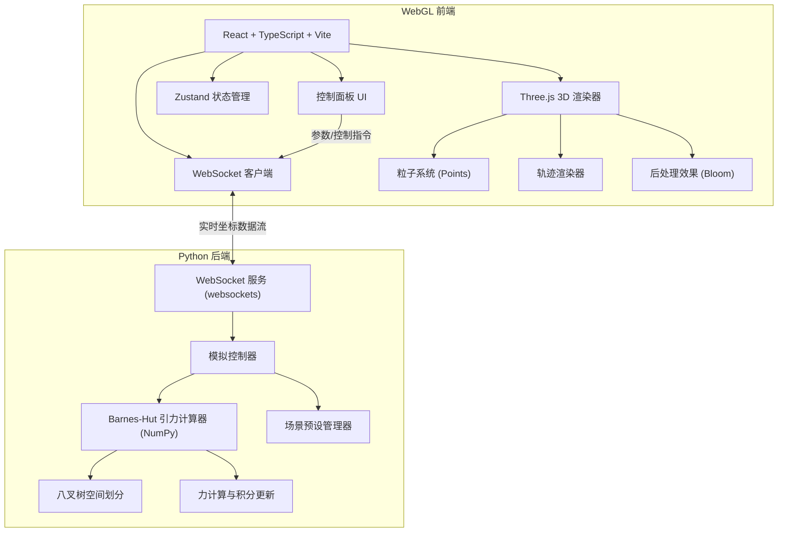

## 1. 架构设计



## 2. 技术描述

### 2.1 后端技术栈
- **编程语言**：Python 3.10+
- **数值计算**：NumPy（向量化运算）
- **算法**：Barnes-Hut 八叉树算法，复杂度 O(N log N)
- **WebSocket 服务**：websockets 库，异步非阻塞
- **并发模型**：asyncio 事件循环，计算任务在独立线程池执行
- **数据序列化**：二进制格式 (struct.pack) 或 JSON

### 2.2 前端技术栈
- **框架**：React 18 + TypeScript
- **构建工具**：Vite 5
- **样式方案**：Tailwind CSS 3
- **状态管理**：Zustand
- **3D 渲染**：Three.js r160+
- **后处理**：@react-three/postprocessing
- **WebSocket 客户端**：原生 WebSocket API + 自动重连
- **图标**：lucide-react

## 3. 目录结构

```
e:\soloM\m84
├── backend/                    # Python 后端
│   ├── src/
│   │   ├── barnes_hut.py      # Barnes-Hut 核心算法
│   │   ├── octree.py          # 八叉树实现
│   │   ├── simulation.py      # 模拟控制器
│   │   ├── scenes.py          # 预设场景定义
│   │   └── server.py          # WebSocket 服务器
│   ├── requirements.txt
│   └── main.py
├── src/                        # 前端源码
│   ├── components/
│   │   ├── NBodyScene.tsx     # 3D 场景主组件
│   │   ├── ControlPanel.tsx   # 控制面板
│   │   ├── StatsHUD.tsx       # 状态显示
│   │   └── ParticleSystem.tsx # 粒子系统
│   ├── hooks/
│   │   └── useWebSocket.ts    # WebSocket 连接 Hook
│   ├── store/
│   │   └── simulationStore.ts # Zustand 状态
│   ├── types/
│   │   └── simulation.ts      # 类型定义
│   ├── utils/
│   │   └── colorMapping.ts    # 颜色映射工具
│   ├── App.tsx
│   ├── main.tsx
│   └── index.css
├── public/
├── package.json
├── tsconfig.json
├── vite.config.ts
└── tailwind.config.js
```

## 4. WebSocket 协议定义

### 4.1 消息类型

| 消息类型 | 方向 | 描述 |
|----------|------|------|
| `config` | 前端→后端 | 设置模拟参数 |
| `control` | 前端→后端 | 控制指令 (start/pause/reset) |
| `scene` | 前端→后端 | 加载预设场景 |
| `state` | 后端→前端 | 星体状态数据 |
| `stats` | 后端→前端 | 性能统计数据 |

### 4.2 数据格式

```typescript
// 星体状态数据 (二进制优化格式)
interface BodyState {
  id: number;
  x: number;      // 位置 X
  y: number;      // 位置 Y
  z: number;      // 位置 Z
  vx: number;     // 速度 X
  vy: number;     // 速度 Y
  vz: number;     // 速度 Z
  mass: number;   // 质量
}

// 模拟配置
interface SimulationConfig {
  gravitationalConstant: number;  // 引力常数 G
  timeStep: number;               // 时间步长
  softening: number;              // 软化因子（避免奇点）
  theta: number;                  // Barnes-Hut 精度参数
}

// 控制指令
type ControlCommand = 'start' | 'pause' | 'reset' | 'step';

// 预设场景
interface ScenePreset {
  id: string;
  name: string;
  description: string;
  bodyCount: number;
  initialConditions: BodyState[];
}
```

## 5. Barnes-Hut 算法设计

### 5.1 核心数据结构

```python
# 八叉树节点
class OctreeNode:
    center: np.ndarray      # 节点中心坐标 (3,)
    size: float             # 节点立方体边长
    mass: float             # 节点内总质量
    com: np.ndarray         # 质心坐标 (3,)
    children: list          # 8 个子节点
    body: Body | None       # 单粒子（叶子节点）

# 星体
class Body:
    pos: np.ndarray         # 位置 (3,)
    vel: np.ndarray         # 速度 (3,)
    acc: np.ndarray         # 加速度 (3,)
    mass: float
```

### 5.2 算法流程

1. **建树**：递归将所有星体插入八叉树
2. **计算力**：对每个星体，遍历八叉树
   - 若节点远且质量集中（s/d < θ），使用质心近似
   - 否则递归遍历子节点
3. **积分更新**：使用 leapfrog 或 Verlet 积分更新位置速度

## 6. 前端渲染设计

### 6.1 粒子系统优化

- 使用 `THREE.BufferGeometry` 存储所有粒子位置
- 使用 `THREE.PointsMaterial` 配合自定义着色器
- 粒子大小根据质量映射，颜色根据速度映射
- 位置数据每帧更新 `geometry.attributes.position.needsUpdate = true`

### 6.2 轨迹渲染

- 每个星体维护一个环形缓冲区存储历史位置
- 使用 `THREE.Line` 渲染轨迹线
- 轨迹颜色随时间淡出，使用顶点颜色实现渐变

### 6.3 后处理管线

```
场景渲染 → BloomEffect (泛光) → VignetteEffect (暗角) → Output
```

## 7. 性能优化策略

### 后端
- NumPy 向量化计算，避免 Python 循环
- 多线程：计算线程与网络 IO 线程分离
- 自适应时间步长，根据系统最大速度调整
- 八叉树每帧重建，复用节点对象池

### 前端
- WebWorker 处理数据解码，不阻塞主线程
- 粒子数量动态调整，维持目标帧率
- 轨迹点数量限制，使用 `drawRange` 优化
- 矩阵自动更新关闭，手动控制更新时机
