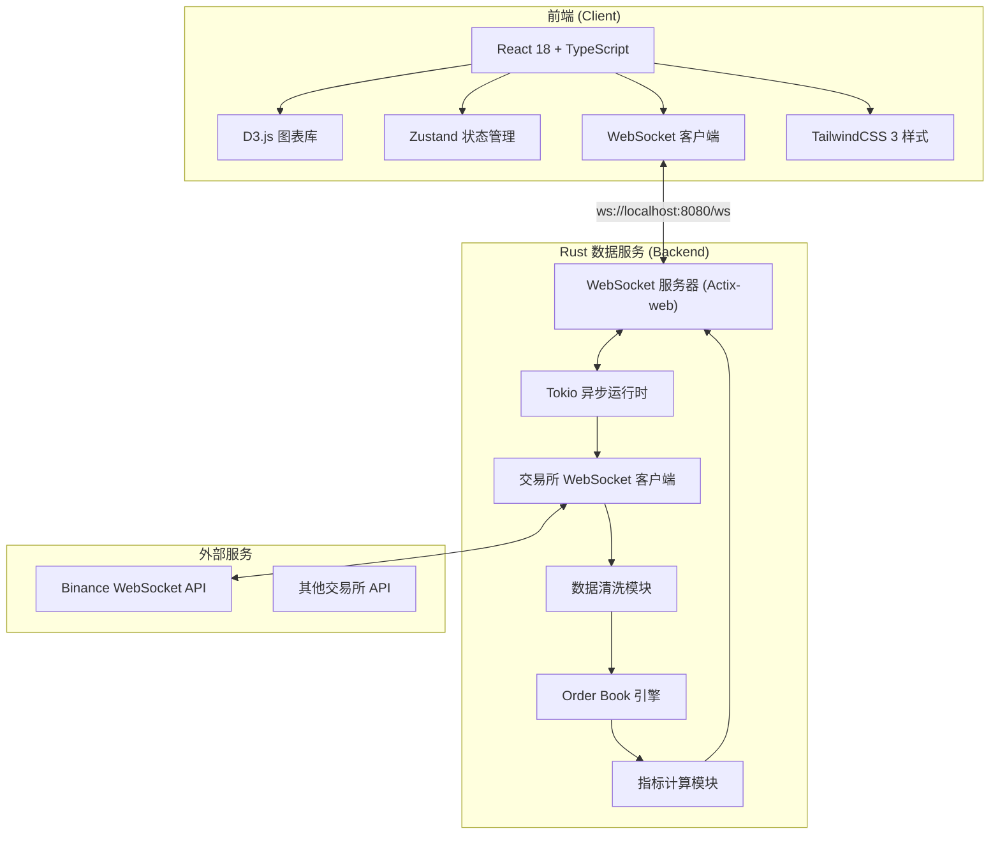
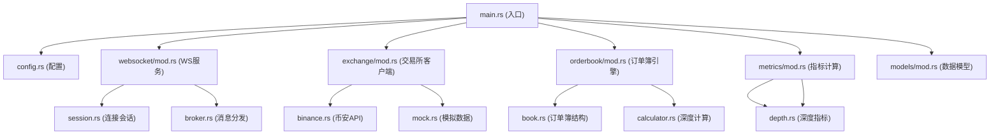
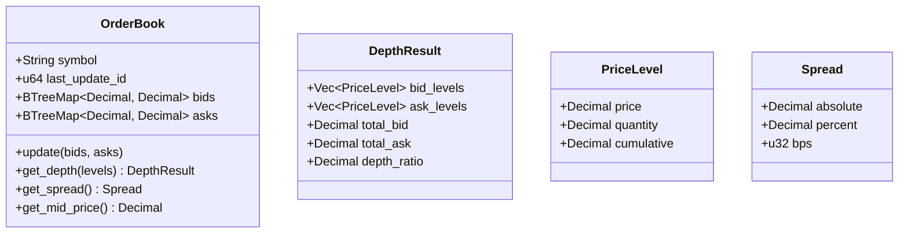

## 1. 架构设计



## 2. 技术描述

### 2.1 前端技术栈
- **框架**：React 18 + TypeScript
- **构建工具**：Vite 5
- **图表库**：D3.js 7.8
- **状态管理**：Zustand
- **样式**：TailwindCSS 3
- **WebSocket**：原生 WebSocket API + reconnecting-websocket

### 2.2 后端技术栈
- **语言**：Rust 1.75+
- **异步运行时**：Tokio 1.35
- **Web 框架**：Actix-web 4.4
- **WebSocket**：tokio-tungstenite
- **序列化**：serde + serde_json
- **配置**：config-rs
- **日志**：tracing + tracing-subscriber

### 2.3 初始化方式
- 前端：`pnpm create vite-init@latest . --template react-ts --force`
- 后端：`cargo new orderbook-service`

## 3. 路由定义

| 路由 | 用途 |
|------|------|
| `/` | 主看板页面，包含所有可视化模块 |
| `/api/health` | 健康检查端点 |
| `/ws` | WebSocket 实时数据流端点 |

## 4. API 定义

### 4.1 WebSocket 消息协议

**客户端发送（订阅）：**
```typescript
interface SubscribeMessage {
  type: "subscribe";
  symbol: string; // e.g., "btcusdt"
  channels: ("trade" | "depth" | "kline")[];
  klineInterval?: "1m" | "5m" | "15m" | "1h";
}

interface UnsubscribeMessage {
  type: "unsubscribe";
  symbol: string;
  channels: string[];
}
```

**服务器推送（数据）：**
```typescript
// 行情快照
interface TickerMessage {
  type: "ticker";
  symbol: string;
  price: string;
  priceChange: string;
  priceChangePercent: string;
  high24h: string;
  low24h: string;
  volume24h: string;
  quoteVolume24h: string;
  timestamp: number;
}

// 订单簿深度
interface DepthMessage {
  type: "depth";
  symbol: string;
  lastUpdateId: number;
  bids: [string, string][]; // [price, quantity]
  asks: [string, string][];
  spread: string;
  spreadPercent: string;
  timestamp: number;
}

// K线数据
interface KlineMessage {
  type: "kline";
  symbol: string;
  interval: string;
  startTime: number;
  closeTime: number;
  open: string;
  high: string;
  low: string;
  close: string;
  volume: string;
  isFinal: boolean;
}

// 成交记录
interface TradeMessage {
  type: "trade";
  symbol: string;
  tradeId: number;
  price: string;
  quantity: string;
  timestamp: number;
  isBuyerMaker: boolean;
}

// 市场指标
interface MarketMetricsMessage {
  type: "metrics";
  symbol: string;
  bidDepth10: string;
  askDepth10: string;
  depthRatio: string;
  spreadBps: number;
  midPrice: string;
  timestamp: number;
}
```

## 5. 后端模块架构



## 6. 数据模型

### 6.1 Order Book 结构



### 6.2 Rust 数据结构定义

```rust
// models/mod.rs
use rust_decimal::Decimal;
use serde::{Deserialize, Serialize};
use std::collections::BTreeMap;

#[derive(Debug, Clone, Serialize, Deserialize)]
pub struct PriceLevel {
    pub price: Decimal,
    pub quantity: Decimal,
    pub cumulative: Decimal,
}

#[derive(Debug, Clone, Serialize, Deserialize)]
pub struct OrderBookSnapshot {
    pub symbol: String,
    pub last_update_id: u64,
    pub bids: Vec<(Decimal, Decimal)>,
    pub asks: Vec<(Decimal, Decimal)>,
    pub timestamp: u64,
}

#[derive(Debug, Clone, Serialize, Deserialize)]
pub struct MarketMetrics {
    pub symbol: String,
    pub mid_price: Decimal,
    pub spread: Decimal,
    pub spread_bps: u32,
    pub bid_depth: Decimal,
    pub ask_depth: Decimal,
    pub depth_ratio: Decimal,
    pub timestamp: u64,
}

#[derive(Debug, Clone, Serialize, Deserialize)]
pub struct KlineData {
    pub symbol: String,
    pub interval: String,
    pub start_time: u64,
    pub open: Decimal,
    pub high: Decimal,
    pub low: Decimal,
    pub close: Decimal,
    pub volume: Decimal,
    pub is_final: bool,
}

#[derive(Debug, Clone, Serialize, Deserialize)]
pub struct TradeData {
    pub symbol: String,
    pub trade_id: u64,
    pub price: Decimal,
    pub quantity: Decimal,
    pub timestamp: u64,
    pub is_buyer_maker: bool,
}
```

## 7. 项目目录结构

```
e:\soloM\m87/
├── frontend/                    # React 前端项目
│   ├── src/
│   │   ├── components/
│   │   │   ├── DepthChart.tsx       # 深度图组件
│   │   │   ├── KlineChart.tsx       # K线图组件
│   │   │   ├── PriceTicker.tsx      # 行情显示
│   │   │   ├── TradeList.tsx        # 成交记录
│   │   │   └── MetricsCard.tsx      # 指标卡片
│   │   ├── hooks/
│   │   │   ├── useWebSocket.ts      # WebSocket连接Hook
│   │   │   └── useOrderBook.ts      # 订单簿状态Hook
│   │   ├── store/
│   │   │   └── marketStore.ts       # Zustand状态管理
│   │   ├── types/
│   │   │   └── market.ts            # TypeScript类型定义
│   │   ├── utils/
│   │   │   └── d3Helpers.ts         # D3.js辅助函数
│   │   └── pages/
│   │       └── Dashboard.tsx        # 主看板页面
│   ├── package.json
│   ├── tsconfig.json
│   ├── vite.config.ts
│   └── tailwind.config.js
│
└── orderbook-service/           # Rust 后端服务
    ├── src/
    │   ├── main.rs
    │   ├── config.rs
    │   ├── models/mod.rs
    │   ├── exchange/
    │   │   ├── mod.rs
    │   │   ├── binance.rs
    │   │   └── mock.rs
    │   ├── orderbook/
    │   │   ├── mod.rs
    │   │   ├── book.rs
    │   │   └── calculator.rs
    │   ├── metrics/
    │   │   ├── mod.rs
    │   │   ├── spread.rs
    │   │   └── depth.rs
    │   └── websocket/
    │       ├── mod.rs
    │       ├── session.rs
    │       └── broker.rs
    ├── Cargo.toml
    ├── Cargo.lock
    └── config.yaml
```
