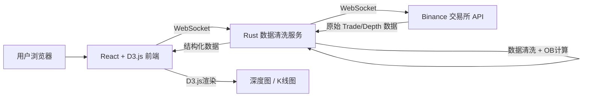

## 1. 产品概述

金融高频交易订单簿实时分析看板，面向加密货币交易员和量化分析师，提供实时市场深度可视化和价差监控。系统通过 Rust 高性能后端实时接收交易所原始数据，经过清洗计算后推送给 React 前端进行可视化展示。

- 核心目标：提供低延迟、高可靠性的订单簿深度分析工具
- 解决问题：传统交易终端数据延迟高、可视化能力不足
- 目标用户：专业加密货币交易员、量化团队、市场分析师

## 2. 核心功能

### 2.1 用户角色

| 角色 | 注册方式 | 核心权限 |
|------|---------|----------|
| 交易员 | 无需注册，直接访问 | 查看实时行情、深度图、K线图 |
| 管理员 | 本地配置 | 配置交易所连接、调整计算参数 |

### 2.2 功能模块

1. **实时行情看板**：最新成交价、24h涨跌幅、24h成交量
2. **订单簿深度图**：买卖盘深度可视化、阶梯式显示
3. **K线走势图**：1分钟/5分钟/15分钟多周期K线
4. **价差监控**：实时买卖价差、滑点计算、流动性指标

### 2.3 页面详情

| 页面名称 | 模块名称 | 功能描述 |
|---------|---------|----------|
| 主看板 | 行情概览 | 实时显示BTC/USDT最新价格、涨跌幅、成交量、买一卖一价 |
| 主看板 | 深度图模块 | D3.js绘制的双向深度图，鼠标悬停显示档位详情 |
| 主看板 | K线图模块 | 支持1m/5m/15m/1h周期切换，实时更新K线 |
| 主看板 | 交易记录 | 最近成交记录实时滚动显示 |
| 主看板 | 市场指标 | 买卖价差、深度比值、流动性指数实时计算 |

## 3. 核心流程

用户打开浏览器访问看板页面 → 前端建立 WebSocket 连接到 Rust 后端 → 后端连接 Binance 等交易所 WebSocket API → 后端接收原始 Trade 和 Depth 数据 → 数据清洗与 Order Book 重建 → 计算深度、价差等指标 → 实时推送给前端 → D3.js 渲染可视化图表 → 用户交互（切换周期、悬停查看）

## 4. 用户界面设计

### 4.1 设计风格

- **主色调**：深色主题，黑色背景 (#0a0e17)，专业金融交易终端风格
- **强调色**：买入绿 (#00c087)，卖出红 (#ff4757)，信息蓝 (#1890ff)
- **字体**：JetBrains Mono 等宽字体（数据展示），Inter（标题文字）
- **布局**：网格化信息密度布局，多模块平铺，实时数据高亮闪烁
- **视觉效果**：微光粒子背景、数据更新脉冲动画、深度图渐变填充

### 4.2 页面设计概述

| 页面名称 | 模块名称 | UI 元素 |
|---------|---------|---------|
| 主看板 | 行情概览 | 大号价格显示带涨跌箭头，价格更新时数字闪烁动画 |
| 主看板 | 深度图模块 | 左右对称的面积图，绿色买单/红色卖单，渐变填充，鼠标十字线 |
| 主看板 | K线图模块 | 蜡烛图，MA均线，成交量柱状图，周期切换按钮组 |
| 主看板 | 交易记录 | 最新成交列表，价格颜色标识，新记录入场滑动动画 |
| 主看板 | 市场指标 | 数值卡片，网格排列，关键指标高亮边框 |

### 4.3 响应性

- 桌面端（1920px+）：四列网格布局，所有模块同时展示
- 平板端（1024px-1919px）：两列布局，深度图与K线图上下排列
- 移动端（768px-1023px）：单列滚动布局，优先显示行情概览和深度图

### 4.4 动效设计

- 价格更新：数字变化时 0.3s 高亮闪烁，根据涨跌显示绿/红色渐变
- 新成交记录：从顶部滑入，带轻微淡入效果
- 深度图更新：数据平滑过渡动画（0.5s easing）
- 页面加载：骨架屏渐进式显示，各模块 staggered 入场
